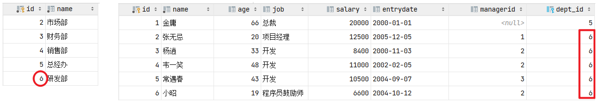
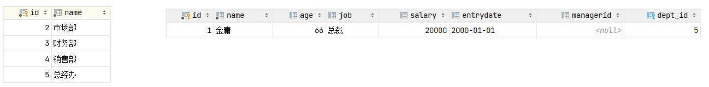
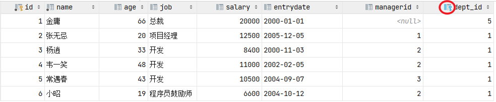
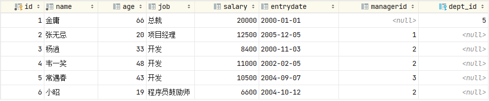
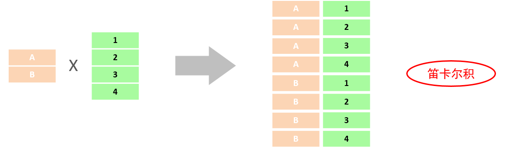
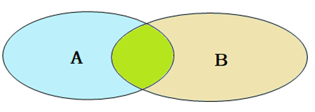
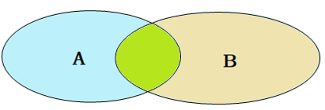

# MySQL

## Overview

### 相关概念

| 数据库         | 存储数据的仓库，数据是有组织的进行存储                       | DataBase（DB）                   |
| -------------- | ------------------------------------------------------------ | -------------------------------- |
| 数据库管理系统 | 操纵和管理数据库的大型软件                                   | DataBase ManagementSystem (DBMS) |
| SQL            | 操作关系型数据库的编程语言，定义了一套操作关系型数据库统一标准 | Structured QueryLanguage (SQL)   |

### Start & Stop

``` shell
net start mysql80
net start mysql80
# 上述的 mysql80 是我们在安装MySQL时，默认指定的mysql的系统服务名，不是固定的，如果未改动，默认就是mysql80
```

### Client Connection

MySQL Command Line Client or CMD

``` shell
mysql [-h host_ip] [-P prot] -u username -p
```

parameter：

- -h: host ip address
- -P: MySQL server port. default 3306
- -u: MySQL Database username
- -p: password

## SQL

Structured Query Language ，操作关系型数据库的编程语言，定义了一套操作关系型数据库统一标准 。

### Grammar

- SQL语句可以单行或多行书写，以分号结尾。
-  SQL语句可以使用空格/缩进来增强语句的可读性。
-  MySQL数据库的SQL语句不区分大小写，关键字建议使用大写。
-  注释：
  - 单行注释：-- 注释内容 或 # 注释内容
  - 多行注释：/* 注释内容 */

### DDL

Data Definition Language 数据定义语言，用来定义数据库对象（数据库，表，字段）

#### create Database

``` sql
CREATE {DATABASE | SCHEMA} [IF NOT EXISTS] db_name
    [create_option] ...

create_option: [DEFAULT] {
    CHARACTER SET [=] charset_name
  | COLLATE [=] collation_name
  | ENCRYPTION [=] {'Y' | 'N'}
}
```

在同一个数据库服务器中，不能创建两个名称相同的数据库，否则将会报错。  可以通过if not exists 参数来解决这个问题，数据库不存在, 则创建该数据库，如果存在，则不创建。  `create database if not extists db_name`。  

指定字符集  `create database db_name default charset utf8mb4  `。

Reference manual

https://dev.mysql.com/doc/refman/8.4/en/create-database.html

https://dev.mysql.com/doc/refman/8.4/en/charset.html

#### Delete Database

如果删除一个不存在的数据库，将会报错。此时，可以加上参数 if exists ，如果数据库存在，再执行删除，否则不执行删除。

``` sql
DROP {DATABASE | SCHEMA} [IF EXISTS] db_name
```

####  USE Statement

[`USE`](https://dev.mysql.com/doc/refman/8.4/en/use.html)语句告诉MySQL将命名数据库作为后续语句的默认（当前）数据库。此语句需要数据库或其中的某些对象的某些权限。

``` sql
USE db_name
```

``` sql
CREATE [TEMPORARY] TABLE [IF NOT EXISTS] tbl_name
    (create_definition,...)
    [table_options]
    [partition_options]

CREATE [TEMPORARY] TABLE [IF NOT EXISTS] tbl_name
    [(create_definition,...)]
    [table_options]
    [partition_options]
    [IGNORE | REPLACE]
    [AS] query_expression

CREATE [TEMPORARY] TABLE [IF NOT EXISTS] tbl_name
    { LIKE old_tbl_name | (LIKE old_tbl_name) }

create_definition: {
    col_name column_definition
  | {INDEX | KEY} [index_name] [index_type] (key_part,...)
      [index_option] ...
  | {FULLTEXT | SPATIAL} [INDEX | KEY] [index_name] (key_part,...)
      [index_option] ...
  | [CONSTRAINT [symbol]] PRIMARY KEY
      [index_type] (key_part,...)
      [index_option] ...
  | [CONSTRAINT [symbol]] UNIQUE [INDEX | KEY]
      [index_name] [index_type] (key_part,...)
      [index_option] ...
  | [CONSTRAINT [symbol]] FOREIGN KEY
      [index_name] (col_name,...)
      reference_definition
  | check_constraint_definition
}

column_definition: {
    data_type [NOT NULL | NULL] [DEFAULT {literal | (expr)} ]
      [VISIBLE | INVISIBLE]
      [AUTO_INCREMENT] [UNIQUE [KEY]] [[PRIMARY] KEY]
      [COMMENT 'string']
      [COLLATE collation_name]
      [COLUMN_FORMAT {FIXED | DYNAMIC | DEFAULT}]
      [ENGINE_ATTRIBUTE [=] 'string']
      [SECONDARY_ENGINE_ATTRIBUTE [=] 'string']
      [STORAGE {DISK | MEMORY}]
      [reference_definition]
      [check_constraint_definition]
  | data_type
      [COLLATE collation_name]
      [GENERATED ALWAYS] AS (expr)
      [VIRTUAL | STORED] [NOT NULL | NULL]
      [VISIBLE | INVISIBLE]
      [UNIQUE [KEY]] [[PRIMARY] KEY]
      [COMMENT 'string']
      [reference_definition]
      [check_constraint_definition]
}

data_type:
    (see Chapter 13, Data Types)

key_part: {col_name [(length)] | (expr)} [ASC | DESC]

index_type:
    USING {BTREE | HASH}

index_option: {
    KEY_BLOCK_SIZE [=] value
  | index_type
  | WITH PARSER parser_name
  | COMMENT 'string'
  | {VISIBLE | INVISIBLE}
  |ENGINE_ATTRIBUTE [=] 'string'
  |SECONDARY_ENGINE_ATTRIBUTE [=] 'string'
}

check_constraint_definition:
    [CONSTRAINT [symbol]] CHECK (expr) [[NOT] ENFORCED]

reference_definition:
    REFERENCES tbl_name (key_part,...)
      [MATCH FULL | MATCH PARTIAL | MATCH SIMPLE]
      [ON DELETE reference_option]
      [ON UPDATE reference_option]

reference_option:
    RESTRICT | CASCADE | SET NULL | NO ACTION | SET DEFAULT

table_options:
    table_option [[,] table_option] ...

table_option: {
    AUTOEXTEND_SIZE [=] value
  | AUTO_INCREMENT [=] value
  | AVG_ROW_LENGTH [=] value
  | [DEFAULT] CHARACTER SET [=] charset_name
  | CHECKSUM [=] {0 | 1}
  | [DEFAULT] COLLATE [=] collation_name
  | COMMENT [=] 'string'
  | COMPRESSION [=] {'ZLIB' | 'LZ4' | 'NONE'}
  | CONNECTION [=] 'connect_string'
  | {DATA | INDEX} DIRECTORY [=] 'absolute path to directory'
  | DELAY_KEY_WRITE [=] {0 | 1}
  | ENCRYPTION [=] {'Y' | 'N'}
  | ENGINE [=] engine_name
  | ENGINE_ATTRIBUTE [=] 'string'
  | INSERT_METHOD [=] { NO | FIRST | LAST }
  | KEY_BLOCK_SIZE [=] value
  | MAX_ROWS [=] value
  | MIN_ROWS [=] value
  | PACK_KEYS [=] {0 | 1 | DEFAULT}
  | PASSWORD [=] 'string'
  | ROW_FORMAT [=] {DEFAULT | DYNAMIC | FIXED | COMPRESSED | REDUNDANT | COMPACT}
  | START TRANSACTION 
  | SECONDARY_ENGINE_ATTRIBUTE [=] 'string'
  | STATS_AUTO_RECALC [=] {DEFAULT | 0 | 1}
  | STATS_PERSISTENT [=] {DEFAULT | 0 | 1}
  | STATS_SAMPLE_PAGES [=] value
  | tablespace_option
  | UNION [=] (tbl_name[,tbl_name]...)
}

partition_options:
    PARTITION BY
        { [LINEAR] HASH(expr)
        | [LINEAR] KEY [ALGORITHM={1 | 2}] (column_list)
        | RANGE{(expr) | COLUMNS(column_list)}
        | LIST{(expr) | COLUMNS(column_list)} }
    [PARTITIONS num]
    [SUBPARTITION BY
        { [LINEAR] HASH(expr)
        | [LINEAR] KEY [ALGORITHM={1 | 2}] (column_list) }
      [SUBPARTITIONS num]
    ]
    [(partition_definition [, partition_definition] ...)]

partition_definition:
    PARTITION partition_name
        [VALUES
            {LESS THAN {(expr | value_list) | MAXVALUE}
            |
            IN (value_list)}]
        [[STORAGE] ENGINE [=] engine_name]
        [COMMENT [=] 'string' ]
        [DATA DIRECTORY [=] 'data_dir']
        [INDEX DIRECTORY [=] 'index_dir']
        [MAX_ROWS [=] max_number_of_rows]
        [MIN_ROWS [=] min_number_of_rows]
        [TABLESPACE [=] tablespace_name]
        [(subpartition_definition [, subpartition_definition] ...)]

subpartition_definition:
    SUBPARTITION logical_name
        [[STORAGE] ENGINE [=] engine_name]
        [COMMENT [=] 'string' ]
        [DATA DIRECTORY [=] 'data_dir']
        [INDEX DIRECTORY [=] 'index_dir']
        [MAX_ROWS [=] max_number_of_rows]
        [MIN_ROWS [=] min_number_of_rows]
        [TABLESPACE [=] tablespace_name]

tablespace_option:
    TABLESPACE tablespace_name [STORAGE DISK]
  | [TABLESPACE tablespace_name] STORAGE MEMORY

query_expression:
    SELECT ...   (Some valid select or union statement)
```

##### Temporary Tables 临时表

You can use the `TEMPORARY` keyword when creating a table. A `TEMPORARY` table is visible only within the current session, and is dropped automatically when the session is closed. For more information, see [Section 15.1.20.2, “CREATE TEMPORARY TABLE Statement”](https://dev.mysql.com/doc/refman/8.4/en/create-temporary-table.html).

##### Table name

The table name can be specified as *`db_name.tbl_name`* to create the table in a specific database. This works regardless of whether there is a default database, assuming that the database exists. If you use quoted identifiers, quote the database and table names separately. For example, write ``mydb`.`mytbl``, not ``mydb.mytbl``.

Rules for permissible table names are given in [Section 11.2, “Schema Object Names”](https://dev.mysql.com/doc/refman/8.4/en/identifiers.html).

##### Table Cloning and Copying 克隆复制表

###### Like 复制表结构

Use `CREATE TABLE ... LIKE` to create an empty table based on the definition of another table, including any column attributes and indexes defined in the original table:

```
CREATE TABLE new_tbl LIKE orig_tbl;
```

###### AS *`query_expression`* 使用查询表达式创建

To create one table from another, add a [`SELECT`](https://dev.mysql.com/doc/refman/8.4/en/select.html) statement at the end of the [`CREATE TABLE`](https://dev.mysql.com/doc/refman/8.4/en/create-table.html) statement:

```sql
CREATE TABLE new_tbl AS SELECT * FROM orig_tbl;
```

###### IGNORE | REPLACE 指定如何处理重复的唯一键

The `IGNORE` and `REPLACE` options indicate how to handle rows that duplicate unique key values when copying a table using a [`SELECT`](https://dev.mysql.com/doc/refman/8.4/en/select.html) statement.

##### data_type 数据类型 

see [Chapter 13, *Data Types*](https://dev.mysql.com/doc/refman/8.4/en/data-types.html).

`AUTO_INCREMENT` applies only to integer types.

Character data types ([`CHAR`](https://dev.mysql.com/doc/refman/8.4/en/char.html), [`VARCHAR`](https://dev.mysql.com/doc/refman/8.4/en/char.html), the [`TEXT`](https://dev.mysql.com/doc/refman/8.4/en/blob.html) types, [`ENUM`](https://dev.mysql.com/doc/refman/8.4/en/enum.html), [`SET`](https://dev.mysql.com/doc/refman/8.4/en/set.html), and any synonyms) can include `CHARACTER SET` to specify the character set for the column. see [Chapter 12, *Character Sets, Collations, Unicode*](https://dev.mysql.com/doc/refman/8.4/en/charset.html). 

For [`CHAR`](https://dev.mysql.com/doc/refman/8.4/en/char.html), [`VARCHAR`](https://dev.mysql.com/doc/refman/8.4/en/char.html), [`BINARY`](https://dev.mysql.com/doc/refman/8.4/en/binary-varbinary.html), and [`VARBINARY`](https://dev.mysql.com/doc/refman/8.4/en/binary-varbinary.html) columns, indexes can be created that use only the leading part of column values, using `*`col_name`*(*`length`*)` syntax to specify an index prefix length.

| 类型        | 大小                       | 有符号(SIGNED)范围                                   | 无符号(UNSIGNED)范围                                    | 描述           |
| ----------- | -------------------------- | ---------------------------------------------------- | ------------------------------------------------------- | -------------- |
| TINYINT     | 1byte                      | (-128，127)                                          | (0，255)                                                | 小整数值       |
| SMALLINT    | 2bytes                     | (-32768，32767)                                      | (0，65535)                                              | 大整数值       |
| MEDIUMINT   | 3bytes                     | (-8388608，8388607)                                  | (0，16777215)                                           | 大整数值       |
| INT/INTEGER | 4bytes                     | (-2147483648，2147483647)                            | (0，4294967295)                                         | 大整数值       |
| BIGINT      | 8bytes                     | (-2^63，2^63-1)                                      | (0，2^64-1)                                             | 极大整数值     |
| FLOAT       | 4bytes                     | (-3.402823466 E+38，3.402823466351 E+38)             | 0 和 (1.175494351 E-38，3.402823466 E+38)               | 单精度浮点数值 |
| DOUBLE      | 8bytes                     | (-1.7976931348623157E+308，1.7976931348623157 E+308) | 0 和(2.2250738585072014E-308，1.7976931348623157 E+308) | 双精度浮点数值 |
| DECIMAL     | 依赖于M(精度)和D(标度)的值 | 依赖于M(精度)和D(标度)的值                           | 小数值(精确定点数)                                      |                |


| 类型       | 大小                  | 描述                         |
| ---------- | --------------------- | ---------------------------- |
| CHAR       | 0-255 bytes           | 定长字符串(需要指定长度)     |
| VARCHAR    | 0-65535 bytes         | 变长字符串(需要指定长度)     |
| TINYBLOB   | 0-255 bytes           | 不超过255个字符的二进制数据  |
| TINYTEXT   | 0-255 bytes           | 短文本字符串                 |
| BLOB       | 0-65 535 bytes        | 二进制形式的长文本数据       |
| TEXT       | 0-65 535 bytes        | 长文本数据                   |
| MEDIUMBLOB | 0-16 777 215 bytes    | 二进制形式的中等长度文本数据 |
| MEDIUMTEXT | 0-16 777 215 bytes    | 中等长度文本数据             |
| LONGBLOB   | 0-4 294 967 295 bytes | 二进制形式的极大文本数据     |
| LONGTEXT   | 0-4 294 967 295 bytes | 极大文本数据                 |

char 与 varchar 都可以描述字符串，char是定长字符串，指定长度多长，就占用多少个字符，和字段值的长度无关 。而varchar是变长字符串，指定的长度为最大占用长度 。  

| 类型      | 大 小 | 范围                                      | 格式                | 描述                     |
| --------- | ----- | ----------------------------------------- | ------------------- | ------------------------ |
| DATE      | 3     | 1000-01-01 至 9999-12-31                  | YYYY-MM-DD          | 日期值                   |
| TIME      | 3     | -838:59:59 至 838:59:59                   | HH:MM:SS            | 时间值或持续时间         |
| YEAR      | 1     | 1901 至 2155                              | YYYY                | 年份值                   |
| DATETIME  | 8     | 1000-01-01 00:00:00 至9999-12-31 23:59:59 | YYYY-MM-DD HH:MM:SS | 混合日期和时间值         |
| TIMESTAMP | 4     | 1970-01-01 00:00:01 至2038-01-19 03:14:07 | YYYY-MM-DD HH:MM:SS | 混合日期和时间值，时间戳 |

#### Alter Table

Add field

```sql
ALTER TABLE t_name ADD field_name data_Type(length) [COMMENT 注释] [约束]
# example
ALTER TABLE t_name ADD field_name varchar(20) COMMENT '注释'
```

Modify data Type

 ```sql
 ALTER TABLE t_name MODIFY filed_name data_type(length);
 ```

Change field name

```sql
ALTER TABLE t_name CHANGE old_field new_field data_type(length) [COMMENT 'comment'] [CONSTRAINT]
```

Delete Field

```sql
ALTER TABLE t_name DROP field_name
```

Rename table

```sql
ALTER TABLE t_name REMANE TO new_t_name
```

Drop table

```sql
DROP TABLE [IF EXISTS] t_name
```

可选项 IF EXISTS 代表，只有表名存在时才会删除该表，表名不存在，则不执行删除操作(如果不加该参数项，删除一张不存在的表，执行将会报错)。  

Truncate table

```sql
TRUNCATE TABLE t_name
```

在删除表的时候，表中的全部数据也都会被删除。  

### DML

Data Manipulation Language. 数据操作语言，用来对数据库表中的数据进行增删改。

#### Insert Data

```sql
INSERT INTO tbl_name (a,b,c) VALUES(1,2,3), (4,5,6), (7,8,9);
INSERT INTO tbl_name (a,b,c) VALUES(1,2,3,4,5,6,7,8,9);
INSERT INTO tbl_name (a,b,c) VALUES ROW(1,2,3), ROW(4,5,6), ROW(7,8,9);
```

##### modifiers

如果你使用 LOW_PRIORITY修饰符，执行 INSERT被延迟，直到没有其他客户端从表中读取。LOW_PRIORITY仅影响仅使用表级锁定的存储引擎（例如MyISAM、MEMORY和MERGE）。

如果你指定`HIGH_PRIORITY`，它覆盖了[`--low-priority-updates`](https://dev.mysql.com/doc/refman/8.4/en/server-system-variables.html#sysvar_low_priority_updates)选项，如果服务器是使用该选项启动的。它还导致不使用并发插入。见[第10.11.3节，“并发插入”](https://dev.mysql.com/doc/refman/8.4/en/concurrent-inserts.html)。

如果使用 IGNORE 修饰符，则执行 INSERT 语句时发生的可忽略错误将被忽略。

#### Update

```sql
UPDATE t_name SET field_name1=value1, field_name2=value2, ... [WHERE condition]
```

#### Delete

```sql
DELETE FROM t_name [WHERE condition]
```

### DQL

Data Query Language. 数据查询语言，用来查询数据库中表的记录。

```sql
SELECT field_list FROM WHERE condition_expr GROUP BY group_field_list HAVING having_expr ORDER BY order_field LIMIT start number;
```

#### Distinct

``` sql
SELECT DISTINCT field_list FROM t_name;
```

#### Order 

```sql
SELECT 字段列表 FROM 表名 ORDER BY 字段1 排序方式1 , 字段2 排序方式2 ;
```

如果是升序, 可以不指定排序方式ASC ;  

如果是多字段排序，当第一个字段值相同时，才会根据第二个字段进行排序 ;


### DCL

  Data Control Language. 数据控制语言，用来创建数据库用户、控制数据库的访问权限。

#### Query User

``` sql
select * from mysql.user;
```

#### Create User

```sql
CREATE USER user_name@host_ip INDENTIFIED BY 'password'
```

#### Alter password

```sql
ALTER USER user_name@host_ip IDENTITIED WITH old_password By new_password
```

#### Delete user

``` sql
DROP USER user_name@host_ip
```

在MySQL中需要通过用户名@主机名的方式，来唯一标识一个用户。 

主机名可以使用 % 通配。  

#### Permission Control

| 权限                | 说明               |
| ------------------- | ------------------ |
| ALL, ALL PRIVILEGES | 所有权限           |
| SELECT              | 查询数据           |
| INSERT              | 插入数据           |
| UPDATE              | 修改数据           |
| DELETE              | 删除数据           |
| ALTER               | 修改表             |
| DROP                | 删除数据库/表/视图 |
| CREATE              | 创建数据库/表      |

##### Query permission

``` sql
SHOW GRANTS FOR user@host_ip
```

##### Grant permission

```sql
GRANT permission_list db_name.t_name TO user_name@host_ip
```

##### Revoke permission

```sql
REVOKE permission_list ON db_name.t_name FROM user_name@host_ip
```

注意事项：

- 多个权限之间，使用逗号分隔
- 授权时， 数据库名和表名可以使用 * 进行通配，代表所有。

#### String function

| 函数                     | 功能                                                      |
| ------------------------ | --------------------------------------------------------- |
| CONCAT(S1,S2,...Sn)      | 字符串拼接，将S1，S2，... Sn拼接成一个字符串              |
| LOWER(str)               | 将字符串str全部转为小写                                   |
| UPPER(str)               | 将字符串str全部转为大写                                   |
| LPAD(str,n,pad)          | 左填充，用字符串pad对str的左边进行填充，达到n个字符串长度 |
| RPAD(str,n,pad)          | 右填充，用字符串pad对str的右边进行填充，达到n个字符串长度 |
| TRIM(str)                | 去掉字符串头部和尾部的空格                                |
| SUBSTRING(str,start,len) | 返回从字符串str从start位置起的len个长度的字符串           |

#### Math function

| 函数       | 功能                               |
| ---------- | ---------------------------------- |
| CEIL(x)    | 向上取整                           |
| FLOOR(x)   | 向下取整                           |
| MOD(x,y)   | 返回x/y的模                        |
| RAND()     | 返回0~1内的随机数                  |
| ROUND(x,y) | 求参数x的四舍五入的值，保留y位小数 |


#### Process function

流程函数也是很常用的一类函数，可以在SQL语句中实现条件筛选，从而提高语句的效率。  

| 函数                                                         | 功能                                                      |
| ------------------------------------------------------------ | --------------------------------------------------------- |
| IF(value , t , f)                                            | 如果value为true，则返回t，否则返回f                       |
| IFNULL(value1 , value2)                                      | 如果value1不为空，返回value1，否则返回value2              |
| CASE WHEN [ val1 ] THEN [res1] ...ELSE [ default ] END       | 如果val1为true，返回res1，... 否则返回default默认值       |
| CASE [ expr ] WHEN [ val1 ] THEN[res1] ... ELSE [ default ] END | 如果expr的值等于val1，返回res1，... 否则返回default默认值 |

demo

```sql
select if(false, 'Ok', 'Error');

select ifnull('Ok','Default');
select ifnull('','Default');
select ifnull(null,'Default');

select
    name,
    (case workaddress 
        when '北京' then '一线城市' 
        when '上海' then '一线城市' 
        else '二线城市' 
        end 
    ) as '工作地址'
from emp;

SELECT 
	id, name,
    (CASE
        WHEN math >= 85 THEN '优秀'
        WHEN math >= 60 THEN '及格'
        ELSE '不及格'
    END) AS '数学成绩'
FROM
 score;

```

#### Constraint

概念：约束是作用于表中字段上的规则，用于限制存储在表中的数据。

目的：保证数据库中数据的正确、有效性和完整性。

| 约束                     | 描述                                                     | 关键字      |
| ------------------------ | -------------------------------------------------------- | ----------- |
| 非空约束                 | 限制该字段的数据不能为null                               | NOT NULL    |
| 唯一约束                 | 保证该字段的所有数据都是唯一、不重复的                   | UNIQUE      |
| 主键约束                 | 主键是一行数据的唯一标识，要求非空且唯一                 | PRIMARY KEY |
| 默认约束                 | 保存数据时，如果未指定该字段的值，则采用默认值           | DEFAULT     |
| 检查约束(8.0.16版本之后) | 保证字段值满足某一个条件                                 | CHECK       |
| 外键约束                 | 用来让两张表的数据之间建立连接，保证数据的一致性和完整性 | FOREIGN KEY |

example

```SQL
CREATE TABLE t_user(
	id INT AUTO_INCREMENT PRIMARY KEY COMMENT 'id',
    name VARCHAR(10) NOT NULL UNIQUE COMMENT 'user name',
    age INT CHECK (age》0 && age<120) COMMENT 'age',
    status CHAR(1) DEFAULT '1' COMMENT 'status',
    gender CHAR(1) COMMENT 'gender'
);
```

##### Foreign key

外键：用来让两张表的数据之间建立连接，从而保证数据的一致性和完整性。  

```sql
CREATE TABLE t_name (
	field1 data_type CONSTRAINT foreign_key_name FOREIGN KEY (foreign_key_field_name) REFERENCES main_table(main_table_column_name)
)
# alter table and add foreign key
ALTER TABLE t_name ADD CONSTRAINT foreign_name FOREIGN KEY foreign_field_name REFERENCES main_table(main_table_column_name)

# delete foreign key
ALTER TABLE 表名 DROP FOREIGN KEY 外键名称;


```

###### 删除/更新行为  

添加了外键之后，再删除父表数据时产生的约束行为，我们就称为删除/更新行为。具体的删除/更新行为有以下几种:  

| 行为        | 说明                                                         |
| ----------- | ------------------------------------------------------------ |
| NO ACTION   | 当在父表中删除/更新对应记录时，首先检查该记录是否有对应外键，如果有则不允许删除/更新。 (与 RESTRICT 一致) 默认行为 |
| RESTRICT    | 当在父表中删除/更新对应记录时，首先检查该记录是否有对应外键，如果有则不允许删除/更新。 (与 NO ACTION 一致) 默认行为 |
| CASCADE     | 当在父表中删除/更新对应记录时，首先检查该记录是否有对应外键，如果有，则也删除/更新外键在子表中的记录。 |
| SET NULL    | 当在父表中删除对应记录时，首先检查该记录是否有对应外键，如果有则设置子表中该外键值为null（这就要求该外键允许取null）。 |
| SET DEFAULT | 父表有变更时，子表将外键列设置成一个默认的值 (Innodb不支持)  |

```sql
ALTER TABLE t_name ADD CONSTRAINT foreign_key_name FOREIGN KEY (field) REFERENCES main_table(column_name) ON UPDATE CASCADE ON DELETE CASCADE;
```

NO ACTION 是默认行为。





级联效果，比如。修改父表id为1的记录，将id修改为6  在子表中dept_id值为1的记录，现在也变为6了，这就是cascade级联的效果。  

删除父表id为6的记录 ，我们发现，父表的数据删除成功了，但是子表中关联的记录也被级联删除了。  


SET NULL  

```sql
alter table emp add constraint fk_emp_dept_id foreign key (dept_id) references
dept(id) on update set null on delete set null ;
```





父表的记录是可以正常的删除的，父表的数据删除之后，再打开子表 emp，我们发现子表emp的dept_id字段，原来dept_id为1的数据，现在都被置为NULL了。  

#### 多表查询

多表查询就是指从多张表中查询数据。  

笛卡尔积: 笛卡尔乘积是指在数学中，两个集合A集合 和 B集合的所有组合情况。  



###### 连接查询  

- 内连接：相当于查询A、B**交集**部分数据
- 外连接：
  - 左外连接：查询左表所有数据，以及两张表交集部分数据
  - 右外连接：查询右表所有数据，以及两张表交集部分数据
- 自连接：**当前表与自身的连接查询**，自连接必须使用表别名

内连接 



内连接查询的是两张表交集部分的数据。(也就是绿色部分的数据)

```sql
SELECT 字段列表 FROM 表1 , 表2 WHERE 条件 ... ;

SELECT 字段列表 FROM 表1 [ INNER ] JOIN 表2 ON 连接条件 ... ;
```

外连接 



左外连接  

```sq
SELECT 字段列表 FROM 表1 LEFT [ OUTER ] JOIN 表2 ON 条件 ... ;
```

左外连接相当于查询表1(左表)的所有数据，当然也包含表1和表2交集部分的数据。

右外连接  

```sql
SELECT 字段列表 FROM 表1 RIGHT [ OUTER ] JOIN 表2 ON 条件 ... ;
```

右外连接相当于查询表2(右表)的所有数据，当然也包含表1和表2交集部分的数据。

自连接  

连接查询，顾名思义，就是自己连接自己，也就是把一张表连接查询多次。  

```sql
SELECT 字段列表 FROM 表A 别名A JOIN 表A 别名B ON 条件 ... ;
```

联合查询  

对于union查询，就是把多次查询的结果合并起来，形成一个新的查询结果集。  

```sql
SELECT 字段列表 FROM 表A ...
UNION [ ALL ]
SELECT 字段列表 FROM 表B ....;
```

- 对于联合查询的多张表的列数必须保持一致，字段类型也需要保持一致。 

- union all 会将全部的数据**直接合并**在一起，union 会对合并之后的数据**去重**。   

子查询

SQL语句中嵌套SELECT语句，称为嵌套查询，又称子查询。  

```sql
SELECT * FROM t1 WHERE column1 = ( SELECT column1 FROM t2 );
```

根据子查询结果不同，分为：

- A. 标量子查询(子查询结果为单个值)
- B. 列子查询(子查询结果为一列)
- C. 行子查询(子查询结果为一行)
- D. 表子查询(子查询结果为多行多列)

根据子查询位置，分为：

- A. WHERE之后
- B. FROM之后
- C. SELECT之后

标量子查询，子查询返回的结果是**单个值**（数字、字符串、日期等），最简单的形式，这种子查询称为标量子查询。  =

```sql
select * from emp where dept_id = (select id from dept where name = '销售部');
```


列子查询，子查询返回的结果是一列（可以是**多行**），这种子查询称为列子查询。

| 操作符 | 描述                                   |
| ------ | -------------------------------------- |
| IN     | 在指定的集合范围之内，多选一           |
| NOT IN | 不在指定的集合范围之内                 |
| ANY    | 子查询返回列表中，有任意一个满足即可   |
| SOME   | 与ANY等同，使用SOME的地方都可以使用ANY |
| ALL    | 子查询返回列表的所有值都必须满足       |

```sql
select * from emp where dept_id in (select id from dept where name = '销售部' or
name = '市场部');
```

行子查询，子查询返回的结果是一行（可以是多列），这种子查询称为行子查询。  =

```sql
select * from emp where (salary,managerid) = (select salary, managerid from emp
where name = 'name');
```

表子查询 ,子查询返回的结果是多行多列，这种子查询称为表子查询。  IN

```sql
select * from emp where (job,salary) in ( select job, salary from emp where name =
'鹿杖客' or name = '宋远桥' );
```

## 事务

事务 是一组操作的集合，它是一个不可分割的工作单位，事务会把所有的操作作为一个整体一起向系统提交或撤销操作请求，即这些操作要么同时成功，要么同时失败。  

```sql
# 查看/设置事务提交方式
SELECT @@autocommit;
SET @@autocommit = 0;

# 开启事务
START TRANSACTION 或 BEGIN;

# 提交事务
COMMIT;

# 回滚事务
ROLLBACK;
```

```sql
-- 开启事务
start transaction

-- 1. 查询张三余额
select * from account where name = '张三';
-- 2. 张三的余额减少1000
update account set money = money - 1000 where name = '张三';
-- 3. 李四的余额增加1000
update account set money = money + 1000 where name = '李四';

-- 如果正常执行完毕, 则提交事务
commit;
-- 如果执行过程中报错, 则回滚事务
-- rollback;
```

#### 事务四大特性  

- 原子性（Atomicity）：事务是不可分割的最小操作单元，要么全部成功，要么全部失败。
- 一致性（Consistency）：事务完成时，必须使所有的数据都保持一致状态。
- 隔离性（Isolation）：数据库系统提供的隔离机制，保证事务在不受外部并发操作影响的独立环境下运行。
- 持久性（Durability）：事务一旦提交或回滚，它对数据库中的数据的改变就是永久的。

上述就是事务的四大特性，简称ACID。

#### 事务隔离级别

为了解决并发事务所引发的问题，在数据库中引入了事务隔离级别。主要有以下几种：

| 隔离级别              | 脏读 | 不可重复读 | 幻读 |
| --------------------- | ---- | ---------- | ---- |
| Read uncommitted      | √    | √          | √    |
| Read committed        | ×    | √          | √    |
| Repeatable Read(默认) | ×    | ×          | √    |
| Serializable          | ×    | ×          | ×    |

查看事务隔离级别  

```sql
SELECT @@TRANSACTION_ISOLATION;
```

设置事务隔离级别

```sql
SET [ SESSION | GLOBAL ] TRANSACTION ISOLATION LEVEL { READ UNCOMMITTED |
READ COMMITTED | REPEATABLE READ | SERIALIZABLE }
```

