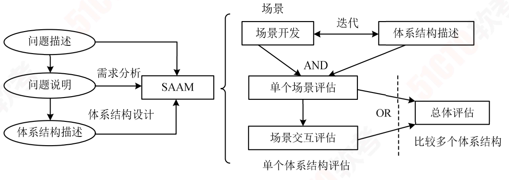
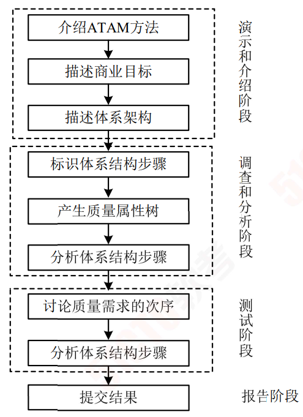
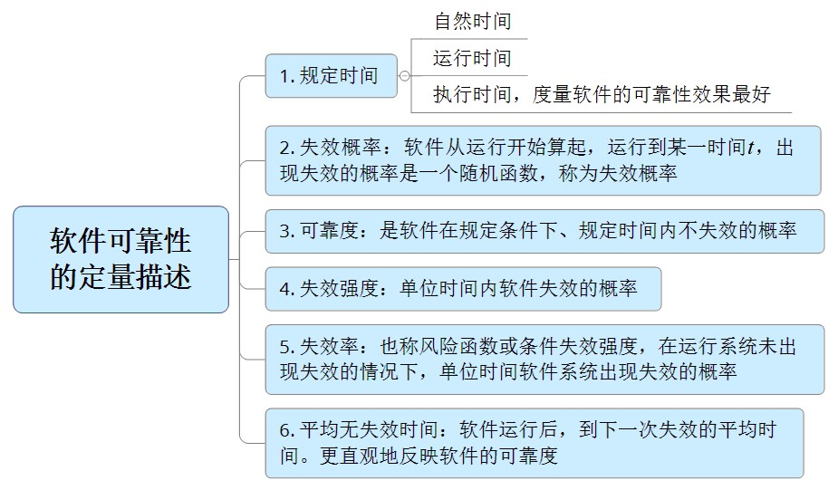
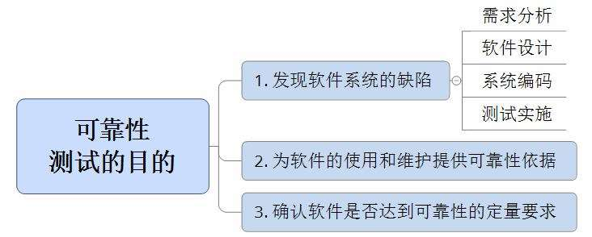
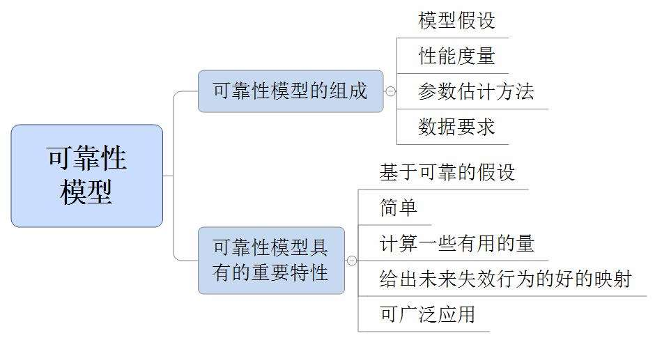
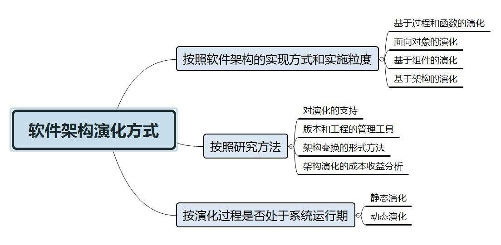
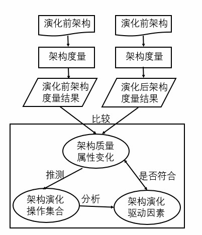

# 系统架构设计 P3

## 系统架构设计基础知识  

###  软件架构概念

#### 软件架构定义

软件架构（Software Architecture）或称软件体系结构，是指系统的**一个或者多个结构**，这些结构**包括软件的构件（可能是程序模块、类或者是中间件）、构件的外部可见属性及其之间的相互关系**。

体系结构的设计包括：

- 数据库设计
- 软件结构设计（关注软件构件的结构、属性和交互作用，并通过多种视图全面描述）

#### 软件架构设计与生命周期

软件架构是贯穿整个生命周期阶段：

| 阶段         | 作用和意义                                           |
| ------------ | ---------------------------------------------------- |
| 需求分析阶段 | 有利于各阶段参与者的交流，也易于维护各阶段的可追踪性 |
| 设计阶段     | 关注的最早和最多的阶段                               |
| 实现阶段     | 有效实现从软件架构设计**向实现的转换**               |
| 构件组装阶段 | 可复用构件组装的设计能够提高系统实现的效率           |
| 部署阶段     | 组织和展示部署阶段的软硬件架构、评估分析部署方案     |
| 后开发阶段   | 主要围绕**维护、演化、复用进行**                     |

##### 需求分析阶段

需求分析阶段软件架构研究还处于起步阶段。

- 需求关注的是**问题空间**
- 架构关注的是解空间

需要**保持二者的可追踪性和转换**。

从软件**需求模型向软件架构模型的转换**主要关注两个问题： 

1. 如何根据需求模型构建软件架构模型。
2. 如何保证模型转换的可追踪性。

##### 设计阶段

研究主要包括：

1. 软件架构模型的描述
2. 软件架构模型的设计与分析方法
3. 对软件架构设计经验的总结与复用

架构模型的描述研究包括：

1. ###### 组成 SA模型（软件架构模型）的基本概念。

   即构件和连接子的建模。

2. ###### 体系架构描述语言（Architecture Describe Language，ADL）。

   是用于描述软件体系架构的语言，与其他建模语言最大的区别在于其更**关注构件间互联机制（连接子）**，典型的 ADL语言包括 Unicon、Rapide、Darwin、Wright、C2SADL、Acme、XADLOL、XYZ/ADL和 ABC/ADL等。

3. ###### 多视图

   反映的是一组系统的不同方面，体现了关注点分散的思想，通常与 ADL结合起来描述系统的体系结构。

   典型的模型包括：4+1模型、Hofmesiter的 4视图模型、CMU-Sei的 Views and Beyond模型。

   视图标准包括：IEEE的 I471-2000、RM-ODP、UML以及 IBM的 Zachman。

   

##### 实现阶段

研究的内容有：

1. 基于 SA的开发过程支持。

2. 寻求从 SA向实现过渡的途径。

3. 研究基于 SA的测试技术。

   缩小软件架构设计与底层实现概念差距的手段：

   1. 模型转换技术
   2. 封装底层的实现细节
   3. 在 SA模型中引入实现阶段的概念（如用程序设计语言描述）

##### 构件组装阶段

研究的内容包括：

1. 如何支持可复用构件的互联，即对 SA设计模型中规约的连接子的实现提供支持。

2. 组装过程中，如何检测并消除体系结构失配问题。

   问题主要包括：

   1. 构件本身的失配
   2. 连接子（互联机制）的失配
   3. 部分和整体的失配

##### 部署阶段

部署阶段的软件架构对软件部署的作用：

1. 提供高层的体系结构视图描述部署阶段的软硬件模型；
2. 二是基于软件架构模型可以分析部署方案的质量属性，从而选择合理的部署方案。

##### 后开发阶段

部署安装后（后开发阶段）的系统架构研究方向包括：

1. 动态软件体系结构
2. 体系结构恢复与重建。

体系结构重建的方法有：

1. 手工体系结构重建
2. 工具支持的手工重建
3. 通过查询语言来自动建立聚集
4. 使用其他技术（如数据挖掘）

#### 软件架构的重要性

软件架构设计是降低成本、改进质量、按时和按需交付产品的关键因素。

软件架构的重要性包括：

1. 架构设计能够**满足系统的品质**。
2. 架构设计**使受益人达成一致的目标**。
3. 架构设计能够**支持计划编制过程**。
4. 架构设计**对系统开发的指导性**。
5. 架构设计能够**有效地管理复杂性**。
6. 架构设计**为复用奠定了基础**。
7. 架构设计能够**降低维护费用**。
8. 架构设计能够**支持冲突分析**。

### 基于架构的软件开发方法

#### 体系结构的设计方法概述

基于体系结构（架构）的软件设计（Architecture-Based Software Design，ABSD）方法是**体系结构驱动的**，即指构成体系结构的**商业、质量和功能需求的组合驱动的**。

在基于体系结构的软件设计方法中：

- 采用**视角与视图来描述软件架构**
- 采用用**例来描述功能需求**
- 采用**质量场景来描述质量需求**

ABSD方法具有三个基础：

1. 功能的分解
2. 通过选择**体系结构风格**来实现**质量和商业需求**
3. 软件模板的使用

ABSD是自顶向下、递归细化的，迭代的每一步都有清晰的定义，有助于降低体系结构设计的随意性。

#### 基于体系结构的开发模型

传统的软件开发模型开发效率较低。

ABSDM模型把整个基于体系结构的软件开发过程划分为六个子过程：

1. 体系结构需求
2. 设计
3. 文档化
4. 复审
5. 实现
6. 演化

#### 体系结构需求

体系结构的需求工作包括：

1. ##### 获取用户需求

   需求的获取一般来自三个方面：

   1. 质量目标
   2. 系统的商业目标
   3. 系统开发人员的商业目标

2. ##### 标识系统中拟用构件

   标识构件分三步完成：

   1. 生成类图
   2. 对类进行分组
   3. 把类打包成构件

架构需求评审的审查重点包括:

1. 需求是否真实**反映了用户的要求**
2. 类的**分组是否合理**
3. 构件**合并是否合理等**

#### 体系结构设计

软件的体系设计过程：

1. 提出软件体系结构**模型**
2. **映射构件**
3. 分析构件**相互作用**
4. 产生体系结构设计**评审**（设计评审必须邀请独立于系统开发的外部人员）

##### 体系结构文档化体

系结构文档化过程的主要输出结果：

1. 体系结构规格说明
2. 测试体系结构需求的质量设计说明书

##### 体系结构复审

一个主版本的软件体系结构分析之后，要安排一次由外部人员（用户代表和领域专家）参加的复审。

复审的目的是**标识潜在的风险**，**及早发现体系结构设计中的缺陷和错误**。

必要时，可搭建一个可运行的最小化系统用于评估和测试体系结构是否满足需要。

##### 体系结构实现

体系结构的实现过程**以复审后的文档化体系结构说明书为基础**。

体系结构说明书中**定义了系统中构件与构件之间的关系**。

实现过程具体为：

1. 分析与设计
2. 构件实现
3. 构件组装
4. 系统测试
   1. 单个构件的功能性测试
   2. 被组装应用的整体功能和性能测试

##### 体系结构演化

体系结构演化史使用系统演化步骤去修改应用，以满足新的需求。

系统演化步骤为：

1. 需求变化归类
2. 体系结构演化计划
3. 构件变动
4. 更新构件的相互作用
5. 构件组装与测试
6. 技术评审
7. 演化后的体系结构

### 软件架构风格

#### 软件架构风格概述

软件体系结构设计的核心目标是**重复的体系结构模式（软件复用/重用）**。

软件体系结构（架构）风格是描述**某一特定应用领域**中**系统组织方式的惯用模式**。

体系结构风格定义一个系统家族，即一个体系结构定义**一个词汇表**和**一组约束**。

- 词汇表：包含**构件和连接件**。
- 约束：约束定义**构件和连接件的组合方式**。

体系结构风格反映了领域中众多系统所**共有的结构**和**语义特性**，并**指导如何将各个模块和子系统有效地组织成一个完整的系统**。

#### 数据流体系结构风格

##### 批处理体系结构风格

每个处理步骤是一个**独立的程序**，每一步必须在**前一步结束后才能开始**，且**数据必须是完整**，以整体的方式传递。

##### 管道和过滤器

把系统分为几个序贯地处理步骤，每个步骤之间通过数据流连接，**一个步骤的输出是另一个步骤的输入**，**每个处理步骤都有输入和输出**。  

##### 调用/返回体系结构风格

在系统中采用了调用与返回机制。

利用调用-返回实际上是一种**分而治之的策略**，主要思想是将一个复杂的**大系统分解为若干个子系统**，降低复杂度，增加可修改性。

1. 主程序/子程序风格：采用单线程控制，把问题划分为若干处理步骤，构件即为主程序和子程序。
2. 面向对象体系结构风格：构件是对象，即抽象数据类型的实例。

##### 层次型体系结构风格

每一层为上层服务，并作为下层的接口。仅相邻层间具有层接口。  

##### 客户端/服务器体系结构风格

1. 二层 C/S模式。

   主要组成部分：

   1. 数据库服务器（后台：负责数据管理）
   2. 客户应用程序（前台：完成与用户交互任务）和网络。

   优点：客户应用和服务器构件分别运行在不同的计算机上。

   缺点：

   1. 开发成本高
   2. 客户端设计复杂
   3. 信息内容和形式单一
   4. 不利于推广
   5. 软件移植困难
   6. 软件维护和升级困难

2. 三层 C/S模式：瘦客户端模式。

   应用该功能分为：

   1. 表示层：用户接口与应用**逻辑层的交互**，不影响业务逻辑，通常使用图**形用户界面**。
   2. 功能层：实现具体的**业务处理逻辑**。
   3. 数据层：数据库管理系统。

##### 浏览器/服务器风格（B/S）

B/S风格，三层应用结构的实现方式。

其三层结构分别为：

1. 浏览器
2. Web服务器
3. 数据库服务器。

相比于 C/S的不足之处：

1. 动态页面的支持能力弱
2. 系统拓展能力差
3. 安全性难以控制
4. 响应速度不足
5. 数据交互性不强

##### 以数据为中心的体系结构风格

1. 仓库体系结构风格：**存储和维护数据**的中心场所。

   组成:

   1. 中央数据结构（说明当前数据状态）
   2. 一组独立构件（对中央数据进行操作）。

2. 黑板体系结构风格：是一种**问题求解模型**，是组织推理步骤、控制状态数据和问题求解之领域知识的概念框架。

   可通过选取各种黑板、知识源和控制模块的构件来设计。

   应用信号处理领域，如语音识别和模式识别。

##### 虚拟机体系结构风格

人为构建一个运行环境，可以解析与运行自定义的一些语言，增加架构的灵活性。

1. 解释器体系结构风格

   通常被用来建立一种虚拟机以**弥合程序语义与硬件语义之间的差异**。

   缺点是执行效率较低。

   典型例子是专家系统。

2. 规则系统体系结构风格

   包括：

   1. 知识库
   2. 规则解释器
   3. 规则/数据选择器
   4. 工作内存（程序运行存储区）

##### 独立构件体系结构风格

强调系统中的每个构件都是相对独立的个体，它们之间不直接通信，以降低耦合度，提升灵活度。  

1. 进程通信体系结构风格：构件是独立的过程，连接件是消息传递。
2. 事件系统体系结构风格：构件不直接调用一个过程，而是触发或广播一个或多个事件。

##### C2风格

C2风格通过连接件连接构件或某个构件组，构件与构件之间无连接。

### 软件架构复用

软件复用是系统化的软件开发过程：开发一组基本的软件构件模块，以覆盖不同的需求/体系结构之间的相似性，提高系统开发的效率、质量和性能。

软件架构复用的类型包括：

1. 机会复用（在开发过程中，只要发现有可复用的资产就复用）。
2. 系统复用（系统复用是在开发前进行规划，决定哪些复用）。

软件架构复用的原因：

1. 减少开发工作
2. 减少开发事件
3. 降低开发成本
4. 提高生产力
5. 提高产品质量
6. 更好的互操作性

可复用的资产包括：需求、架构设计、元素、建模分析、测试、项目规划、过程+方法+工具、人员、样本系统、缺陷消除。

一般形式的复用包括：

1. 函数的复用
2. 库的复用
3. 面向对象开发中的类
4. 接口和包的复用

软件架构复用的基本过程：

1. 首先构建/获取可复用的软件资产（复用前提）
2. 管理可复用资产
3. 使用可复用资产

### 特定领域软件体系结构  

#### 定义

特定领域软件架构（Domain Specific Software Architecture，DSSA）是**在一个特定应用领域中**为一组应用**提供组织结构参考的标准软件体系结构**，即用于某一类特定应用领域的标准软件构件集合。

DSSA的特征：

- 领域性
- 普遍性
- 抽象性
- 可复用性

#### DSSA的基本活动

DSSA的基本活动有：

1. 领域分析，析领域中系统的共性需求，建立领域模型。
2. 领域设计，设计 DSSA，且 DSSA需要具备领域需求变化的适应性。
3. 领域实现，获取可重用信息。

参与 DSSA的人员：

1. 领域专家
2. 领域分析师
3. 领域设计人员
4. 领域实现人员

DSSA的建立过程：

1. 是并发的
2. 递归的
3. 反复的螺旋模型

建立过程五个阶段：

1. 定义领域**范围**
2. 定义领域**特定元素**
3. 定义领域特定的**设计和实现约束**
4. 定义领域模型和**体系结构**
5. **产生、搜集可重用的单元**

三个层次的系统模型：

1. 领域开发环境
2. 领域特定应用开发环境
3. 应用执行环境

## 系统质量属性与架构评估

### 软件系统质量属性

软件系统质量属性是一个系统的**可测量**或**可测试**的属性。

基于软件系统的生命周期，可将软件系统的质量属性分为**开发期质量属性**和**运行期质量属性**。

1. ##### 开发期质量属

   1. 易理解性，指设计被开发人员理解的难易程度。

   2. 可扩展性，软件因**适应新需求**或**需求变化而增加新功能**的能力，也称灵活性。
   3.  可重用性，指重用软件系统或某一部分的难易程度。
   4. 可测试性，对软件测试以证明其满足需求规范的难易程度。                     
   5. 可维护性，当需要修改缺陷、增加功能、提高质量属性时，识别修改点并实施修改的难易程度。
   6. 可移植性，将软件系统从一个运行环境转移到另一个不同的运行环境的难易程度。

2. ##### 运行期质量属性

   1. 性能，软件系统及时提供相应服务的能力，如速度、吞吐量和容量等。
   2. 安全性，软件系统同时兼顾向合法用户提供服务，以及阻止非授权使用的能力。
   3. 可伸缩性，当用户数和数据量增加时，软件系统**维持高服务质量**的能力。
   4. 互操作性，软件系统与其他系统**交换数据**和**相互调用服务**的难易程度。
   5. 可靠性，软件系统在一定的时间内**持续无故障运行的能力**。
   6. 可用性， 系统在一定时间内**正常工作的时间所占比例**。
   7. 鲁棒性， 软件系统在非正常情况（用户进行非法操作、相关软硬件系统发生故障）下**仍正常运行的能力**，也称健壮性或容错性。

#### 面向架构评估的质量属性

1. 性能，效率指标：处理任务所需时间或单位时间内的处理量。
2. 可靠性
   1. 容错，出现错误后仍能保证系统争取运行，且自行修正错误。
   2. 健壮性 ，错误不对系统产生影响，按既定程序忽略错误。
3. 可用性 ，正常运行的时间比例。
4. 安全性，系统向合法用户提供服务并阻止非法用户的能力。
5. 可修改性
   1. 可维护性，局部修复使故障对架构的负面影响最小化。
   2. 可扩展性，因松散耦合更易实现新特性/功能，不影响架构。
   3. 结构重组，不影响主体进行的灵活配置。
6. 可移植性，适用于多样的环境（硬件平台、语言、操作系统等）。
7. 功能性，需求的满足程度。
8. 可变性，总体架构可变。
9. 互操作性，通过可视化或接口方式提供更好的交互操作体验。

提升或保证这些质量属性的**应对措施**：

1. 可用性。
   1. 错误检测：心跳、Ping/Echo、异常。
   2.  错误恢复：表决、主动冗余、被动冗余、重新同步、内测、检查点/回滚。
   3. 错误避免：服务下线、事务、进程监控器。
2. 性能。
   1. 资源的需求：减少处理事件时对资源的占用、减少处理事件的数量、控制资源的使用。
   2.  资源管理：并发机制、增加资源。
   3. 资源仲裁：先来先服务、固定优先级、动态优先级、静态调度。
3. 可修改性。
   1. 局部化修改：高内聚低耦合、预测变更、使模块通用。
   2. 防止连锁反应：信息隐藏、维持现有接口、限制通信路径、使用中介。
   3. 推迟绑定时间：运行时注册、多态、配置文件。
4. 安全性。
   1. 抵抗攻击：用户身份验证、用户授权、维护数据机密性与完整性、限制暴露、限制访问。
   2. 检测攻击：入侵检测系统。
   3.  从攻击中恢复：恢复状态、识别攻击者。

#### 质量属性场景描述

质量属性场景是一种面向特定质量属性的需求，由**刺激源、刺激、环境、制品、响应、响应度量**组成。

刺激源（Source）：某个**生成该刺激的实体**（人、计算机系统或者任何其他刺激器）。

刺激（Stimulus）：指当**刺激到达系统时需要考虑的条件**。

环境（Environment）：指该刺激在某些条件内发生。当激励发生时，系统可能处于过载、运行或者其他情况。

制品（Artifact）：**某个制品被激励，可能是整个系统，也可能是系统的一部分**。

响应（Response）：指在**激励到达后所采取的行动**。

响应度量（Measurement）：当响应发生时，应当能够以某种方式对其进行度量，以对需求进行测试。

### 系统架构评估

系统架构评估是在对架构分析、评估的基础上，对架构策略的选取进行决策，

通常分为：

1. 基于调**查问卷或检查表**的方法：缺点是很大程度上依赖于评估人员的主观判断。
2. 基于**场景**的评估方法：应用在架构权衡分析法（ATAM）和软件架构分析方法（SAAM）中。
3. 基于**度量**的评估方法：
   1. 建立质量属性和度量之间的映射原则
   2. 在软件文档中获取度量信息
   3. 分析推导系统质量属性

#### 系统架构评估中的重要概念

1. 敏感点：实现质量目标时应注意的点，是一个或多个**构件的特性**。
2. 权衡点：**影响多个质量属性的敏感点**。
3. 风险承担者或利益相关人：影响体系结构或被体系结构影响的群体。
4. 场景：确定架构质量评估目标的交互机制，一般采用触发机制（教材中解释为“刺激”）、环境和影响三方面来描述。

#### 系统架构评估方法

软件架构分析方法（Software Architecture Analysis Method，SAAM）。一种**非功能质量属性的架构分析方法**，是最早形成文档并得到广泛应用的**软件架构分析方法**。

输入：

1. 问题描述
2. 需求说明
3. 架构描述

分析过程主要包括：

1. 场景开发
2. 架构描述
3. 单个场景评估
4. 场景交互
5. 总体评估

#### 架构权衡分析法（Architecture Tradeoff Analysis Method，ATAM）

ATAM是一种系统架构评估方法。

主要在系统开发之前，针对性能、可用性、安全性和可修改性等**质量属性**进行评价和折中。

传统的 ATAM可以分为 4个主要的活动阶段：

1. 需求收集
2. 架构视图描述
3. 属性模型构造和分析
4. 架构决策与折中

ATAM整个评估过程**强调以属性作为架构评估的核心概念**。

现代的 ATAM方法采用**效用树**对质量属性进行分类和优先级排序。

用 ATAM方法评估软件体系**结构分为**：

1. ##### 演示（Presentation）

   使用 ATAM评估软件体系结构的初始阶段，包括 3个步骤：

   1. 介绍 ATAM：描述 ATAM评估过程。
   2. 介绍业务驱动因素：着重业务视角，提供有关系统功能、主要利益相关方、业务目标和其他限制等信息。
   3. 介绍要评估的体系结构：侧重可用性以及体系结构的质量要求。

2. ##### 调查和分析

   对一些关键问题彻底调查。

    3个步骤：

   1. 确定架构方法：涉及能够理解系统关键需求的关键架构方法。

   2. 生成质量属性效用树：确定最重要的质量属性，并确定优先次序。

   3. 分析体系结构方法：彻底调查和分析，找出处理相应质量属性架构的方法。

      包括 4个主要阶段：

      1. 调查架构方法
      2. 创建分析问题
      3. 分析问题的答案
      4. 找出风险、非风险、敏感点和权衡点

3. ##### 测试

   1. 头脑风暴和优先场景：将头脑风暴的优先列表与生成质量属性效用树中所获取的优先方案进行比较。
   2. 分析架构方法。

4. ##### 测试和报告

   提供评估期间收集的所有信息，呈现给利益相关者。

评估方法的对比  

| 项目                 | SAAM                                                         | ATAM                                                         |
| -------------------- | ------------------------------------------------------------ | ------------------------------------------------------------ |
| 特定目标             | 通过程序文档验证体系结构，注重发现潜在问题，可用于评价单系统或进行多系统比较 | 确定在多个质量属性之间折中的必要性                           |
| 评估技术             | 场景技术                                                     | 场景技术、启发式分析方法                                     |
| 质量属性             | 可修改性是主要分析内容                                       | 性能、可用性、安全性和可修改性                               |
| 风险承担者           | 所有参与者                                                   | 场景和需求收集过程中的相关人                                 |
| 架构描述             | 围绕功能、结构和分配描述                                     | 五个基本结构及其映射关系                                     |
| 方法活动             | 场景开发、体系结构描述、单个场景评估、场景交互和总体评估     | 场景和需求收集、体系结构视图和场景实现、属性模型构造和分析、折中 |
| 知识库可复用性       | 不涉及                                                       | 有基于属性的体系模型，可复用                                 |
| 方法验证（应用领域） | 空中交通管制系统、嵌入式音频系统、修正控制系统               | 仍处于研究中                                                 |

#### 成本效益分析法（Cost Benefit Analysis Method，CBAM）

分为：

1. 整理场景
2. 对场景进行求精
3. 确定场景的优先级
4. 分配效用
5. 架构策略涉及哪些质量属性及响应级别
6. 用内插法确定“期望的”质量属性响应级别的效用
7. 计算各架构策略的总收益
8. 根据受成本限制影响的 ROI选择架构策略。

#### 其他评估方法

##### SAEM方法

将软件架构看作一个**最终产品**以及涉及过程中的一个**中间产品**，从外部质量属性和内部质量属性阐述的评估模型。

##### SAABNet方法

辅助架构的**定性评估**，帮助**诊断软件问题**的可能原因，分析架构中的**修改给质量属性带来的影响**、**预测架构的质量属性**，**帮助架构设计人员做决策**。

SAABNet度量的对象包括：

1. 架构属性
2. 质量准则
3. 质量因素

##### SACMM方法

一种软件架构**修改的度量方法**，首先基于内核定义差异度量准则来计算两个软件架构之间的距离，然后分析对象之间的相似性。

##### SASAM方法

通过对**预期架构和实际架构**进行映射和比较来静态地评估软件架构。

##### ALRRA方法

是软件架构**可靠性风险评估方法**，使用动态复杂度准则和动态耦合度准则来定义组件和连接件的复杂性因素。

##### AHP方法

把定性分析和定量计算相结合，对各种决策因素进行处理。

##### COSMIC+UML方法

针对不同表达方式的软件架构，采用统一的软件度量 COSMIC方法来进行度量和评估。

## 软件可靠性基础知识

### 软件可靠性基本概念

#### 软件可靠性的定义

软件可靠性是指在规定的时间内，软件**不引起系统失效的概率**。该概率是系统输入和系统使用的函数，也是软件中存在的缺陷函数；系统输入将确定是否会遇到已存在的缺陷。

#### 软件可靠性的定量描述

软件的可靠性是在软件使用条件、在规定时间内、系统的输入/输出、系统使用等变量构成的数学表达式。

#### 可靠性的目标

可靠性是指用户对所使用的软件的**性能满意程度的期望**。可以用**可靠度、平均失效时间和故障强度**等来描述。

#### 可靠性测试的意义与目的

可靠性测试的意义是：

1. 软件失效可能造成灾难性的后果。
2. 软件的失效在整个计算机系统失效中的比例较高。
3. 相比硬件可靠性技术，软件可靠性技术不成熟。
4. 软件可靠性问题会造成软件费用增长。
5. 系统对软件的依赖性强，对生产活动和社会生活影响日益增大。

广义的可靠性测试与狭义的可靠性测试

广义的可靠性测试是为了**最终评价软件系统的可靠性**而运用建模、统计、试验、分析和评价等一系列手段对软件系统实施的一种测试。

狭义的可靠性测试指为了获**取可靠性数据**，按预先确定好的测试用例，在软件预期使用环境中，对软件实施的一种测试。

###  软件可靠性建模

#### 影响软件可靠性的因素：

1. **运行环境**
2. 软件**规模**
3. 软件的**内部结构**
4. 软件的**开发方法**
5. **开发环境**
6. 软件的**可靠性投入**

#### 软件可靠性模型的组成和特性

#### 软件可靠性建模方法

- 种子法
- 失效率类
- 曲线拟合类
- 可靠性增长
- 程序结构分析
- 输入域分类
- 执行路径分析方法
- 非齐次泊松过程
- 马尔可夫过程
- 贝叶斯分析

### 软件可靠性管理

#### 软件可靠性管理的各阶段：

1. 需求分析阶段
2. 概要设计阶段
3. 详细设计阶段
4. 编码阶段
5. 测试阶段
6. 实施阶段

### 软件可靠性设计

软件可靠性设计技术有：

1. ##### 容错设计技术

   1. 恢复块设计：选择一组操作作为容错设计单元，把普通的程序块变成恢复块。
   2. N版本程序设计：通过设计多个模块或不同版本，对相同初始条件和相同输入的操作结果，实行多数表决，防止其中某一软件模块/版本的故障提供错误的服务。  
   3. 冗余设计：在一套完整的软件系统之外，设计一种不同路径、不同算法或不同实现方式方法的模块或系统作为备份，在出现故障时可使用冗余部分进行替换。  

2. ##### 检错技术

   检错技术代价低于容错技术和冗余技术，但是不能自动解决故障，需要人工干预。

   检错技术着重考虑四个要素：

   1. 检测对象
   2. 检测延时
   3. 实现方式
   4. 处理方式

3. ##### 降低复杂度设计

   降低复杂度设计思想是在保证实现软件功能基础上，简化软件结构、缩短程序代码长度、优化软件数据流向、降低软件复杂度、提高软件可靠性。

4. ##### 系统配置技术

   1. 双机热备技术。

      1. 采用“心跳”方法保证主系统与备用系统的联系。

         根据两台服务器的工作方式分为：

         1. 双机热备模式（一台工作，一台后备）
         2. 双机互备模式（两台运行相对独立应用，互为后备）
         3. 双机双工模式（两台同时运行相同应用，互为后备）

   2. 服务器集群技术。

      集群内各节点服务器通过内部局域网相互通信，若某节点服务器发生故障，这台服务器运行的应用被另一节点服务器自动接管。

### 软件可靠性测试

#### 概述

软件可靠性测试包括：

1. 可靠性目标的确定
2. 运行剖面的开发
3. 测试用例的设计
4. 测试实施
5. 测试结果分析

#### 定义软件运行剖面

为软件的**使用行为建模**，**开发使用模型**，**明确需测试内容**。

#### 用例设计

测试用例要能够**反映实际的使用情况**，优先测试最重要的和最频繁使用的功能。

测试用例的组成 ：

1. 测试用例标识
2. 被测对象
3. 测试环境及条件
4. 测试输入
5. 操作步骤
6. 预期输出
7. 判断输出结果是否符合标准
8. 测试对象的特殊需求

#### 软件可靠性测试的实施

用时间定义的软件**可靠性数据**分为 4类：

1. 失效时间数据

2. 失效间隔时间数据

3. 分组时间内的失效数

4. 分组时间的累积失效数。

   

测试记录组成：

1. 测试**时间**
2. 含有测试用例的**测试说明或标识**
3. 所有与测试有关的**测试结果**，包括**失效数据**
4. 测试人员

与测试报告组成：

1. 软件**产品标识**
2. 测试**环境配置**
3. 测试**依据**
4. 测试**结果**
5. 测试**问题**
6. 测试**时间**

### 软件可靠性评价

#### 1．软件可靠性评价概念

评估和预测软件可靠性过程包括：

1.  选择可靠性模型。
2. 收集可靠性数据。
3. 可靠性评估和预测。

可靠性模型：

1.  模型**假设的适用性**。
2. 预测**的能力与质量**。
3. **模型输出值**能否满足可靠性的评价需求。
4. 模型使用的**简便性**。

收集数据办法：

1. **尽可能早地确定**可靠性模型。
2. 数据收集计划要有较强的**可操作性**。
3. 重视测试数据的**分析和整理**。
4. 充分**利用技术手段**（数据库技术）来完成分析和统计。

软件可靠性的评估和预测

1. 目的：评估软件系统的**可靠性状况**和预测将来一段时间的**可靠性水平**。
2. 以软件可靠性**模型分析为主**，以**失效数据的图形分析法**和**试探性数据分析技术**等为辅。

## 软件架构的演化和维护

### 软件架构演化和定义的关系

#### 演化的重要性

1. 保障软件系统具备诸多好的特性。
2. 有效管控软件系统的**整体复杂性和变化性**，降低软件检修和修改成本。
3. 保证软件系统**演化的一致性和正确性**，增加便捷性。

#### 演化和定义的关系

软件架构包括组件、连接件和约束三大要素，此软件架构演化主要关注组件、连接件和约束的**添加、修改和删除**。

###  面向对象软件架构演化过程

#### 对象演化

**产生影响的演化**包括：

1. Add Object（AO） 

   AO是在系统需要**添加新的对象来实现某种新的功能**，或需将现有对象的某个功能独立以增加架构灵活性时发生。

2. Delete Object（DO）

   DO是在系统需要**移除某个现有的功能**，或需**合并某些对象及其功能**来降低架构的复杂度的时候发生。

#### 消息演化

消息演化包括：

1.  Add Message（AM）

   增添一条新的消息，产生在对象之间需要增加新的交互行为的时候。

2. Delete Message（DM）

   删除当前的一条消息，产生在需要移除某交互行为的时候。

3. Swap Message Order（SMO）

   交换两条消息的时间顺序，发生在需要改变两个交互行为之间的时候。

4. Overturn Message（OM）

   反转消息的发送对象与接收对象，发生在需要修改某个交互行为本身的时候。

5. Change Message Module（CMM）

   改变消息的发送或接收对象，发生在需要修改某个交互行为本身的时候

#### 复合片段演化

复合片断的演化包括

1. Add Fragment（AF）

   在某几条消息上新增复合片段，发生在需要增添新的控制流时。

2. Delete Fragment（DF）

   删除某个现有的复合片段，发生在需要移除当前某段控制流时。

3. Fragment Type Change （FTC）

   改变复合片段的类型，发生在需要改变某段控制流时。

4. Fragment Condition Change（FCC）

   改变复合片段内部执行的条件，发生在改变当前控制流的执行条件时。

#### 约束演化约束演化

包括：

1.  Add Constraint（AC）

   直接添加新的约束信息，需判断当前设计是否满足新添加的约束要求。

2. Delete Constraint（DC）

   直接移除某条约束信息，发生在去除某些不必要条件的时候。

### 软件架构演化方式的分类

三种比较典型的软件架构演化方式的分类。

#### 软件架构演化时期

1. 设计时演化：发生在体系结构模型与之相关的**代码编译之前**。
2. 运行前演化：发生在**执行之前、编译之后**。
3. 有限制运行时演化：只发生在**某些特定约束满足时**。
4. 运行时演化：发生在**运行时不能满足要求时**。

#### 软件架构静态演化

1. 静态演化需求：
   1. 设计时演化需求
   2. 运行前演化需求
2. 静态演化的一般过程：
   1. 软件理解
   2. 需求变更分析
   3. 演化计划
   4. 系统重构
   5. 系统测试
3. 静态演化的原子演化操作

与可维护性相关的架构演化操作：

1. AMD（Add Module Dependence）
2. RMD（Remove Module Dependence）
3. AMI（Add Module Interface）
4. RMI（Remove Module Inferface）
5. AM（Add Module）
6. RM（Remove Module）
7. SM（Split Module）
8. AGM（Aggregate Modules）

与可靠性相关的架构演化操作：

1. AMS（Add Message）
2. RMS（Remove Message）
3. AO（Add Object）
4. RO（Remove Object）
5. AF（Add Fragment）
6. RF（Remove Fragment）
7. CF（Change Fragment）
8. AU（Add Use Case）
9. RU（Remove Use Case）
10. AA（Add Actor）
11. RA（Remove Actor）。

#### 软件架构动态演化

##### 动态演化需求

软件内部执行所导致的体系结构改变、软件系统外部的请求对软件进行的重配置。

##### 动态演化的类型

1. 软件动态性的等级：
   1. 交互动态性
   2. 结构动态性
   3. 架构动态性
2. 动态演化的内容
   1. 属性改名
   2. 行为变化
   3. 拓扑结构改变
   4. 风格变化

##### 动态软件架构（DSA）

基本原理：运行时刻体系结构相关信息的改变可用来触发、驱动系统自身的动态调整。

DSA描述语言：

1. 基于行为视角的 π-ADL
2. 基于反射视角的 Pilar
3. 基于协调视角的 LIME

DSA演化工具：

1. 使用反射机制
2. 基于组件操作
3. 基于 π演算
4. 利用外部的体系结构演化管理器

动态软件架构应用实例—PKUAS 4种类型：

1. 容器系统
2. 公共服务
3. 工具和微内核
4. 动态重配置。
   1. 动态重配置模式：主从模式、中央控制模式、客户端/服务器模式、分布式控制模式。
   2. 例子：可重用、可配置的产品线架构。
   3. 难点：
      1. 约束定义困难
      2. 性能约束难以静态衡量
      3. 难以管理所有方面
      4. 需同时保证组件系统完整性
      5. 重配置策略的正确和安全性

### 软件结构演化原则

软件结构包括 18种可持续演化原则：

1. 演化成本控制原则：演化成本要控制在预期的范围之内。
2. 进度可控原则：架构演化要在预期的时间内完成。
3. 风险可控原则：架构演化中的经济风险、时间风险、人力风险、技术风险和环境风险在可控范围内。
4. 主体维持原则：软件演化的平均增量的增长须保持平稳，保证软件系统主体行为稳定。
5. 系统总体结构优化原则：使演化后的软件系统整体结构（布局）更加合理。
6. 平滑演化原则：软件的演化速率趋于稳定。
7. 目标一致原则：架构演化的阶段目标和最终目标要一致。
8. 模块独立演化原则：软件中各模块自身的演化最好相互独立。
9. 影响可控原则：如果一个模块发生变更，给其他模块带来的影响在可控范围内。
10. 复杂性可控原则：必须控制架构的复杂性，保障软件的复杂性在可控范围内。
11. 有利于重构原则：使演化后软件架构便于重构。
12. 有利于重用原则：演化最好能维持，甚至提高整体架构的可重用性。
13. 设计原则遵循性原则：架构演化最好不能与架构设计原则冲突。
14. 适应新技术原则：软件要独立于特定的技术手段，可运行于不同平台。
15. 环境适应性原则：架构演化后的软件版本比较容易适应新的硬件环境和软件环境。
16. 标准依从性原则：演化不违背相关质量标准（国际标准、国家标准、行业标准等）。
17. 质量向好原则：使所关注的某个质量指标或质量指标的综合效果变更好。
18. 适应新需求原则：很容易适应新的需求变更。

#### 软件架构演化评估方法

##### 演化过程已知的评估

评估流程：将架构度量应用到演化过程中，通过对演化前后的不同版本的架构分别进行度量，得到度量结果的差值及其变化趋势，并计算架构间质量属性距离，进而对相关质量属性进行评估。

##### 演化过程未知的评估

### 大型网站系统架构演化实例

#### 第一阶段：单体架构

应用程序、数据库、文件等**所有资源都在一台服务器上**。

#### 第二阶段：垂直架构

**将应用和数据分离**。

整个网站使用 3台服务器：

1. 应用服务器
2. 文件服务器
3. 数据服务器。

#### 第三阶段：使用缓存改善网站性能

包括在应用服务器上的**本地缓存**和在专门的分布式缓存服务器上的**远程缓存**。

#### 第四阶段：使用服务集群改善网站并发处理能力

通过**负载均衡**调度服务器，将来自用户浏览器的访问请求分发到应用服务器集群中的任何一台服务器上，**解决高并发、海量数据问题**。

#### 第五阶段：数据库读写分离

应用服务器在**写数据时，访问主数据库**，**主服务器通过主从复制机制将数据更新同步到从服务器**。在应用服务器**读数据时，访问从数据库**。

#### 第六阶段：使用反向代理和 CDN加速网站响应

CDN和反向代理的基本原理都是缓存。

1. CDN部署在网络提供商的机房，用户在请求网站服务时，可在距离最近的网络提供商机房获取数据。
2. 反向代理部署在网站的中心机房，用户请求到达中心机房后，先访问反向代理服务器。

#### 第七阶段：使用分布式文件系统和分布式数据库系统

进行业务分库，将不同业务的数据**部署在不同的物理服务器上**

#### 第八阶段：使用 NoSQL和搜索引擎

#### 第九阶段：业务拆分

将一个网站拆分成许多不同的应用，每个应用独立部署。

#### 第十阶段：分布式服务

软件架构维护

软件架构**维护过程**：

1. 包括软件架构**知识管理**

   架构知识的定义：架构知识=架构设计+架构设计决策。

   架构知识管理的含义：侧重于软件开发和实现过程所涉及的架构静态演化，在架构文档等信息来源中捕捉架构知识，提供架构的质量属性及其设计依据进行记录和评价。

   架构知识管理的需求：防止关键的设计知识“沉没”在软件架构中。

2. 软件架构**修改管理**

   主要是建立一个隔离区域，保障该区域中任何修改对其他部分影响最小。

3. 软件架构**版本管理等**

   为软件架构演化的版本演化控制、使用和评价提供可靠依据。  

   

架构可维护性的 6个度量指标：

1. 圈复杂度（CNN）
2. 扇入扇出度（FFC）
3. 模块间耦合度（CBO）
4. 模块的响应（RFC）
5. 紧内聚度（TCC）
6. 松内聚度（LCC）。

## 未来信息综合技术  

### 信息物理系统技术概述

信息物理系统（Cyber-Physical System，CPS）是控制系统、嵌入式系统的扩展与延伸。

CPS通过集成先进的感知、计算、通信、控制等信息技术和自动控制技术，构建了物理空间与信息空间中人、机、物、环境、信息等要素相互映射、适时交互、高效协同的复杂系统，实现系统内资源配置和运行的按需响应、快速迭代、动态优化。

CPS的本质是构建一套信息空间与物理空间之间基于数据自动流动的状态感知、实时分析、科学决策、精准执行的闭环赋能体系，解决生产制造、应用服务过程中的复杂性和不确定性问题，提高资源配置效率，实现资源优化。

#### CPS的实现

CPS的体系结构分为：

1. 单元级
2. 系统级
3. SOS级

CPS技术体系主要包括：

1. CPS总体技术（顶层设计技术）
2. CPS支撑技术（基于应用支撑）
3. CPS核心技术（基础技术）。

CPS技术了分为四大核心技术要素：

1. “一硬”（感知和自动控制，是 CPS实现的硬件支撑）
2. “一软”（工业软件，CPS核心）
3. “一网” （工业网络，是网络载体）
4. “一平台”（工业云和智能服务平台，是支撑上层解决方案的基础）。

#### 信息物理系统的建设和应用

CPS典型应用场景有：

1. 智能设计方面：产品及工艺设计、生产线/工厂设计。
2. 智能生产方面：设备管理应用场景、生产管理应用场景、柔性制造应用场景。
3. 智能服务方面：健康管理、智能维护、远程征兆诊断、协同优化、共享服务。
4. 智能应用方面：无人装备、产业链互动、价值链共赢

CPS的建设路径是：

1. CPS体系设计
2. 单元级 CPS建设
3. 系统级 CPS建设
4. SOS级 CPS建设。

### 人工智能技术概述

人工智能是利用数字计算机或数字计算机控制的机器模拟、延伸和扩展人的智能，感知环境、获取知识并使用知识获得最佳结果的理论、方法、技术及应用系统。

人工智能根据是**否能真正实现推理、思考和解决问题**，分为弱人工智能和强人工智能。

人工智能的发展历程：

1. 图灵测试
2. “人工智能”术语
3. 机器学习
4. 专家系统
5. 计算机战胜双陆棋世界冠军
6. 决策树模型和神经网络
7. IBM深蓝战胜国际象棋世界冠军
8. 深度学习
9. 爆发式发展

#### 人工智能关键技术

1. 自然语言处理：包括机器翻译、语义理解、问答系统等。
2. 计算机视觉：如自动驾驶、机器人、智能医疗。
3. 知识图谱：可用于发欺诈、不一致性验证、组团欺诈等对公共安全保障形成威胁的领域。
4. 人机交互：传统的基本交互、图形交互、语音交互、情感交互、体感交互及脑机交互等。
5. 虚拟现实或增强现实：在一定范围内生成与真实环境在视觉、听觉等方面高度近似的数字化环境。
6. 机器学习。
   1. 按学习模式不同分为：
      1. 监督学习（需提供标注的样本集）
      2. 无监督学习（不需提供标注的样本集）
      3. 半监督学习（需提供少量标注的样本集）
      4. 强化学习（需反馈机制）
   2. 按学习方法不同分为：
      1. 传统机器学习（需手动完成）
      2. 深度学习（需大量训练数据集和强大GPU服务器提供算力）
   3. 机器学习常见算法：
      1. 迁移学习
      2. 主动学习
      3. 演化学习

### 机器人技术概述

定义：

- 具体脑、手、脚等三要素个体
- 具有非接触传感器和接触传感器
- 具有平衡觉和固定觉的传感器

发展历程：

1. 第一代机器人（示教再现型机器人）
2. 第二代机器人（感觉型机器人）
3. 第三代机器人（智能型机器人）

#### 机器人 4.0核心技术

机器人 4.0核心技术包括云—边—段的无缝协同计算、持续学习与协同学习、知识图谱、场景自适应和数据安全。

#### 机器人分类

按控制方式分类包括：

1. 操作机器人
2. 程序机器人
3. 示教再现机器人
4. 智能机器人
5. 综合机器人

按应用行业分类包括：

1. 工业机器人
2. 服务机器人
3. 特殊领域机器人

### 边缘计算

#### 边缘计算概念

边缘计算就是将**数据的处理**、**应用程序的运行**以及一些**功能服务的实现**，**由网络中心下放到网络边缘节点上**。

关于边缘计算的具体定义目前有以下几种观点：

1. 边缘计算产业联盟对边缘计算的定义：云计算**在数据中心之外汇聚节点的延伸和演进**，包括云边缘、边缘云和云化网关三类落地形态；以“边云协同”和“边缘智能”为核心和发展方向。
2. OpenStack社区的定义概念：为应用开发者和服务提供商在网络边缘侧提供云服务和 IT环境服务，目标是**在靠近数据输入或用户的地方提供计算、存储和网络带宽**。
3. ISO/IEC JTC1/SC38对边缘计算给出的定义：在靠近物或数据源头的网络边缘侧，融合网络、计算、存储、应用核心能力的开放平台，就近提供边缘智能服务。
4. 国际标准组织定义：提供移动网络边缘 IT服务和计算能力，靠近移动用户。

#### 边缘计算的特点

1. ##### 联接性

   所联接物理对象的多样性及应用场景的多样性，需要边缘计算具备丰富的联接功能，如各种网络接口、网络协议等。

2. ##### 数据第一入口

   边缘计算拥有大量、实时、完整的数据，可基于数据全生命周期进行管理与价值创造，将更好地支撑预测性维护、资产效率与管理等创新应用。

3. ##### 约束

   边缘计算产品需适配工业现场相对恶劣的工作条件与运行环境。

   在工业互联场景下，对边缘计算设备的功耗、成本、空间也有较高的要求。

   边缘计算产品需要考虑通过软硬件集成与优化，以适配各种条件约束，支撑行业数字化多样性场景。

4. ##### 分布性

   边缘计算实际部署天然具备分布式特征。

   能力：

   1. 分布式计算与存储
   2. 实现分布式资源的动态调度与统一管理
   3. 支撑分布式智能
   4. 具备分布式安全

#### 数据协同

边缘节点主要负责现场/终端数据的采集，按照规则或数据模型对数据进行初步处理与分析，并将处理结果以及相关数据上传给云端；

云端提供海量数据的存储、分析与价值挖掘。

边缘与云的数据协同，支持数据在边缘与云之间可控有序流动，形成完整的数据流转路径，高效低成本对数据进行生命周期管理与价值挖掘。

#### 智能协同

边缘节点执行推理，实现分布式智能；

云端开展模型训练，并将模型下发边缘节点。

#### 应用管理协同

边缘节点提供应用部署与运行环境，并对本节点多个应用的生命周期进行管理调度；云端主要提供应用开发、测试环境，以及应用的生命周期管理能力。

#### 业务管理协同

边缘节点提供模块化、微服务化的应用/数字孪生/网络等应用实例；

云端主要提供按照客户需求实现应用/数字孪生/网络等的业务编排能力。

#### 服务协同

边缘节点按照云端策略实现部分 ECSaaS服务，通过 ECSaaS与云端 SaaS的协同实现面向客户的按需 SaaS服务；

云端主要提供 SaaS服务在云端和边缘节点的服务分布策略，

以及云端承担的 SaaS服务能力。

#### 边缘计算的安全

边缘安全的价值体现在：

1. 提供可信的**基础设施**
2. 为边缘应用提供**可信赖的安全服务**
3. 提供**安全可信的网络和覆盖**。

#### 边缘计算应用场合

边缘计算应用场合：

1. 智慧园区
2. 安卓云与云游戏
3. 视频监控
4. 工业物联网
5. Cloud VR

### 数字孪生体技术概述

#### 数字孪生体的定义

数字孪生体是现有或将有的物理实体对象的数字模型，通过实测、仿真和数据分析来实时感知、诊断、预测物理实体对象的状态，通过优化和指令来调控物理实体对象的行为，通过相关数字模型间的相互学习来进化自身，同时改进利益相关方在物理实体对象生命周期内的决策。

#### 数字孪生体的关键技术

建模、仿真和基于数据融合的数字线程。

#### 数字孪生体的应用

数字孪生体主要应用于制造、产业、城市和战场

### 云计算和大数据技术概述

云计算技术概述：“云计算”是同时描述一个系统平台或一类应用程序的术语，包含平台和应用。

云计算的服务方式有：

1.  软件即服务（SaaS）：服务提供商将应用软件统一部署在云计算服务器上。
2. 平台即服务（PaaS）：服务提供商将分布式开发环境与平台作为一种服务来提供。
3. 基础设施即服务（IaaS）：服务提供商将多台服务器组成“云端”基础设施作为计量服务提供给客户。云计算的部署模式：公有云、社区云、私有云、混合云。

大数据分析步骤：

1. 数据获取/记录
2. 信息抽取/清洗/注记
3. 数据集成/聚集/表现
4. 数据分析/建模
5. 数据解释

大数据应用领域：

- 制造业
- 服务业
- 交通行业
- 医疗行业

## 系统规划  

###  系统规划概述

主要步骤包括：

1. 对现有系统进行初步**调查**。
2. **分析**和**确定系统目标**。
3. 分析子系统的组成和基本功能。
4. 拟定系统的实施方案。
5. 进行系统的可行性研究，编写可行性研究报告，召开可行性论证会
6. 制订系统建设方案。

### 系统调查

系统调查可以分为两个阶段：

1. 初步调查。

   在规划阶段进行初步调查可了解企业的**组织结构**和**系统功能**等。

   具体包括：

   1. 初步需求分析
   2. 企业基本状况
   3. 管理方式和基础数据管理状况
   4. 现有系统状况

2. 详细调查

   详细调查则可以**深入了解系统的处理流程**。

   调查的内容有：

   1. 现有系统的运行环境和状况
   2. 组织结构
   3. 业务流程
   4. 系统功能
   5. 数据资源与数据流程
   6. 资源情况
   7. 约束条件和薄弱环节。

### 成本效益分析技术

#### 成本

按照成本性态分类，可以分为：

1. 固定成本：

   是指其总额在一定时期和一定业务量范围内，**不受业务量变动的影响而保持固定不变的成本**。

   如：

   1. 管理人员的工资
   2. 办公费
   3. 固定资产折旧费
   4. 员工培训费等

2. 变动成本：

   也叫可变成本，指在一定时期和一定业务量范围内其总额**随着业务量的变动而成正比例变动的成本**。

   如：

   1. 直接材料费
   2. 产品包装费
   3. 外包费用
   4. 开发奖金等

3. 混合成本：

   即混合了固定成本和变动成本的性质的成本。这些成本通常有一个基数，**超过这个基数就会随业务量的增大而增大**。

   如：质量保证人员的工资、设备动力费等成本在一定业务量内是不变的，超过了这个量便会随业务量的增加而增加。

#### 盈亏临界点

盈亏临界点也称盈亏平衡点或保本点，是指**项目收入和成本相等的经营状态**，就是既不盈利又不亏损的状态。

相关公式如下：

- 利润＝(销售单价-单位变动成本)×销售量-总固定成本。
- 盈亏临界点销售量＝总固定成本/(销售单价-单位可变成本)。
- 盈亏临界点销售额＝总固定成本/(1-总可变成本/销售收入)。
