# 系统架构设计 P4

## 信息系统架构设计理论与实践  

### 基本概念  

定义：

1. 信息系统架构是**系统的结构**，由**软件元素**、**元素外部可见属性**和**元素间关系**组成。

2. 信息系统架构**是软件系统结构**、**行为**和**属性**的**高级抽象**，由**系统元素描述**、元素间相互作用、**元素集成模式**及**模式约束**组成。

3. 信息系统架构是**系统的基础组织**，体现**为构件、构件间关系、构件和环境间关系、构件设计和演进的原则**。

4. 对于定义的理解：

   1. 架构是系统的抽象：元素、元素外部可见属性和元素间关系反映系统的抽象。

   2. 架构是结构的组合：结构**从功能角度描述元素间关系**。

   3. 系统必然存在架构：无论是否存在抽象、模型和具体的描述文档。

   4. 架构是元素的集合：元素组成系统，元素外部可见属性表现系统功能，元素间关系表现系统对外部刺激的响应；

      从静态角度，架构关注系统的**总体结构**（模式）；

      从动态角度，架构关注系统**行为的共同特征**。

   5. 架构具有基础特性：架构具有重复性问题的通用解决方案的复用性，架构在系统设计过程中通过设计决策对系统造成深远影响，这种影响反映架构敏感。

   6. 架构隐含设计决策：架构是对关键功能和非功能性需求进行设计与决策的最终设计结果。

#### 信息系统架构的影响

影响架构的因素有：

1. 外部干系人：对系统有不同的关注和需求。
2. 内部干系人：知识结构、素质、经验、技术环境影响需求和设计。

架构对影响因素也具有反作用：

1. 影响外部干系人：业务影响组织结构。
2. 影响内部干系人：架构具有示范性、复用性，提供商机。

###  信息系统架构风格与分类

#### 信息系统架构风格:

1. 数据流体系结构风格：批处理，管道-过滤器。
2. 调用/返回体系结构风格：主程序/子程序，面向对象，层次结构。
3. 独立构件体系结构风格：进程通信，事件系统。
4.  虚拟机体系结构风格：解释器，规则系统。
5. 仓库体系结构风格：数据库，超文本，黑板。

#### 信息系统架构分类

1. 信息系统物理结构包括：
   1. 单体应用；
   2. 分布式结构。
2. 信息系统逻辑结构：
   1. 横向综合：将**同一管理层次**的各个业务职能综合到一起。
   2. 纵向综合：将**同一业务**的各个管理层次智能综合到一起。
   3. 纵横综合：将**各个业务的各个管理层次**统一综合到一起，主要从信息模型和处理模型两方面着手，建立公用的数据库和统一的信息处理系统。

### 信息系统常用架构模型

#### 单体应用

运行在单台物理机器上的独立应用程序。

应用领域就是信息系统领域，也就是**以数据处理为核心**的系统。

#### 客户机/服务器

客户机/服务器是信息系统中最常见的模式，这种模式下客户端和服务器间通过 TCP/UDP进行请求和应答。

常见的客户机/服务器形式有以下几种：

1. 二层 C/S（Client/Server）。这是一种胖客户端，主要是指前台客户端 +后台数据库的形式。

2. 三层 C/S和 B/S（Browser/Server）如下所述。

   1. 三层 C/S：前台客户端+后台服务端+后台数据库。
   2. 瘦客户端：前台界面和业务逻辑处理分离，前台客户端仅含前台界面。
   3. 三层 B/S：Web浏览器+Web服务器+后台数据库。

3. 多层 C/S和 B/S结构。

   1. 多层 C/S：是指三层以上的结构：

      1. **前台客户端**

      2. 后台服务

      3. **中间件/应用层**

         作用有3点：

         1. 提高并发性能和可伸缩性；
         2. 请求转发，业务逻辑处理；
         3. 增加数据安全性。

      4. 数据库

   2. 多层 B/S：是指三层以上的结构：

      1. **Web浏览器**
      2. Web服务器
      3. **中间件/应用层**
      4. 数据库。

B/S本质是浏览器与服务器间采用基于 TCP/IP或 UDP的 HTTP协议。前台客户端与后台服务端通信协议有：TCP/IP协议，基于 TCP/IP协议通过 Socket自定义实现的协议，RPC协议， CORBA/IIOP协议，Java RMI协议，J2EE JMS协议，HTTP协议。

#### 模型-视图-控制器（Model-View-Controller，MVC）

在 J2EE架构中，形式是：

- Web浏览器（View）
-  Web服务器（Controller也可以是加上中间件/应用层的形式）
- 数据库

关于模型层可根据实际情况与 MV一起置于 Web服务器，或单独置于应用层。

#### 面向服务架构（SOA）

在 SOA中服务的概念是指能**提供一组整体功能的独立应用系统**。

这个应用系统被去掉任何一层服务，都将不能正常工作。

在实践中，要实现 SOA可以借助诸如消息中间件、交易中间件等中间件来实现。

SOA的应用模式最典型、最流行的就是 Web Service，即两个互联网应用之间可以互相向对方**开放一些功能模块、函数、过程等“服务”**，然后通过**消息机制**或**远程过程调用**（Remote Procedure Call，RPC）这样的中间件去调用对方的服务。

面向服务架构主要实践有：

1. 异构系统集成
2. 同构系统聚合
3. 联邦架构。

#### 企业服务总线（ESB）/企业数据总线（EDB）

企业总线是企业应用间信息交换的公共通道，具有如下特征：

1. 连接软件系统，主要提供**服务代理功能和服务注册表**。
2. 按照协议消息头进行数据、请求、回复的接收和分发。
3.  可以基于消息中间件、事务中间件、CORBA/IIOP协议开发构建。

### 企业信息系统总体框架

信息系统的架构（Information System Architecture，ISA）是**多维度、分层次、高度集成化**的模型。

#### 信息系统的架构内容

要在企业中建立一个有效集成的 ISA，必须考虑企业中的 4个方面：

1. ##### 战略系统

   企业中与战略制定、高层决策有关的管理活动和计算机辅助系统。

   组成：

   1. 企业战略规划体系
   2. 以计算机为基础的高层决策支持系统

   战略系统是信息系统**对企业高层管理者决策支持的能力**，也是企业战略规划对信息系统建设的影响和要求。

   企业战略可以分为：

   1. 长期（规划较为稳定，如调整产品结构）。
   2. 短期（规划适用于如决定新产品的类型的情况）。

2. ##### 业务系统

   企业中**完成一定业务功能的各个部分组成的系统**，其中的功能通过一些业务过程来完成。

   业务过程组成：

   1. 相互依赖的业务活动
   2. 业务活动先后次序
   3. 业务活动执行角色
   4. 业务活动处理相关数据

   业务系统作用：

   1. 对企业现有业务系统，过程，活动**建模**；
   2. 在企业战略指导下，采用业务过程重组**优化业务过程**；
   3. 对企业**优化业务系统，过程，活动建模；**
   4. 确定相对稳定数据；
   5. 以稳定数据为基础，进行应用系统开发和信息基础设施建设。

3. ##### 应用系统

   应用系统是指信息系统中的**应用软件部分**。

   应用系统包括两个部分:

   1. 界面部分。应用系统中**相对变化较多的部分**，主要由用户对界面形式要求的变化引起。
   2. 功能实现。相对来说**处理的数据变化较小**，而程序的算法和控制结构的变化较多，主要由用户对应用系统功能需求的变化和对界面形式要求的变化引起。

4. ##### 企业信息基础设施

   根据企业当前业务和可预见的发展趋势，及对信息采集、处理、存储和流通的要求，构筑由信息设备、通信网络、数据库、系统软件和支持性软件等组成的环境。

### 信息系统架构设计方法

#### TOGAF架构

框架TOGAF是国际权威组织 The Open Group（TOG）制订的企业架构标准框架。

TOGAF目标有 4个：

1. 节省时间和成本，更有效、合理地利用资源。
2. 实现可观的投资回报率。（
3. 确保从关键利益相关方到团队成员的所有用户都使用相同的语言。
4. 避免被“锁定”到企业架构的专有解决方案。

核心思想：模块化架构，**为架构产品提供内容框架**，为大型组织开发提供扩展指南，适用于不同架构风格。

TOGAF的组件：

1. 架构开发方法
2. 架构开发方法指南和技术
3. 架构内容框架
4. 企业连续序列和工具
5. 架构框架参考模型
6. 架构能力框架

#### 架构开发方法（Architecture Development Method，ADM）

由一组按照架构领域的架构开发顺序而排列成一个环的多个阶段所构成。

阶段：

1. 预备
2. 需求管理
3. 架构愿景
4. 业务架构
5. 信息系统架构
6. 技术架构
7. 机会和解决方案
8. 迁移规划
9. 实施治理
10. 架构变更管理

#### 信息化内容与模式

信息化包括 4个方面的内容：

1. 信息网络体系
2. 信息产业基础
3. 社会运行环境
4. 效用积累过程

信息化具有 6个要素：

1. 开发利用信息资源
2. 建设国家信息网络
3. 推进信息技术应用
4. 发展信息技术和产业
5. 培育信息化人才
6. 制订和完善信息化政策

通常信息化包括了 7个平台：

1. 知识管理平台
2. 日常办公平台
3. 信息集成平台
4. 信息发布平台
5. 协同工作平台
6. 公文流转平台
7. 企业通信平台

信息化也具有 9个特征：

1. 易用性
2. 健壮性
3. 平台化
4. 灵活性
5. 扩展性
6. 安全性
7. 门户化
8. 整合性
9. 移动性

信息化架构具有两种模式：

1. 数据导向架构。关注数据模型和数据质量。
2. 流程导向架构。关注端到端流程整合及对流程变化的适应度。

#### 信息化建设生命周期

1. 系统规划
2. 系统分析
3. 系统设计
4. 系统实施
5. 系统运行和维护

#### 信息化工程总体规划方法

1. ##### 关键成功因素法（Critical Success Factors，CSF）

   **对企业的成功起关键作用的因素**。CSF就是通过分析**找出使得企业成功的关键因素**，然后再**围绕这些关键因素来确定系统的需求，并进行规划**。

2. ##### 战略目标集转化法（Strategy Set Transformation，SST）

   SST反映了**各种人的要求**，而且给出了按这种要求的分层，然后**转化为信息系统目标的结构化方法**。

3. ##### 企业系统规划法（Business System Planning，BSP）

   BSP通过**自上而下地识别系统目标、企业过程和数据**，然后对数据进行分析，**自下而上**地**设计信息系统**。

## 层次式架构设计理论与实践  

### 层次式体系结构概述

软件体系结构为软件系统提供了**结构**、**行为**和**属性**的高级抽象，由构成系统的元素描述这些元素的相互作用、指导元素集成的模式以及这些模式的约束组成。

层次式体系结构设计是一种常见的架构设计方法，它将系统组成为一个层次结构，每一层为上层服务，并作为下层客户。

在一些层次系统中，除了一些精心挑选的输出函数外，内部的层接口只对相邻的层可见。层次式体系结构的每一层最多只影响两层，同时只要给相邻层提供相同的接口，也允许每层用不同的方法实现，这种方式也为软件重用提供了强大的支持。

#### 层次式应用的组成

大部分的应用会分成：

1. 表现层（或称为展示层）
2. 中间层（或称为业务层）
3. 访问层（或称为持久层）
4. 数据层

#### 特点与注意事项

采用分层架构设计的一个特点就是**关注点分离**。每层中的组件只负责本层的逻辑，组件的划分也很容易明确组件的角色和职责，比较容易开发、测试、管理和维护。

层次式体系结构是一个可靠的通用的架构，但是设计时要注意以下两点：

1. 容易成为污水池反模式（Architecture Sinkhole Anti-patter）：

   请求流简单地穿过几个层，每层里面基本没有做任何业务逻辑，或者做了很少的业务逻辑。

   比如一些 Java EE例子，业务逻辑层只是简单地调用了持久层的接口，本身没有什么业务逻辑。

2. 分层架构可能会让应用变得庞大。

### 表现层框架设计

#### MVC（Model-View-Controller）模式

MVC是一种软件设计模式。

MVC把一个应用的输入、处理、输出流程按照视图、控制、模型的方式进行分离，形成了控制器、模型、视图 3个核心模块。

- 控制器（Controller）：接受用户的输入，并调用模型和视图去完成用户的需求。
- 模型（Model）：应用程序的主体部分，表示业务数据和业务逻辑。
- 视图（View）：用户看到并与之交流的界面。

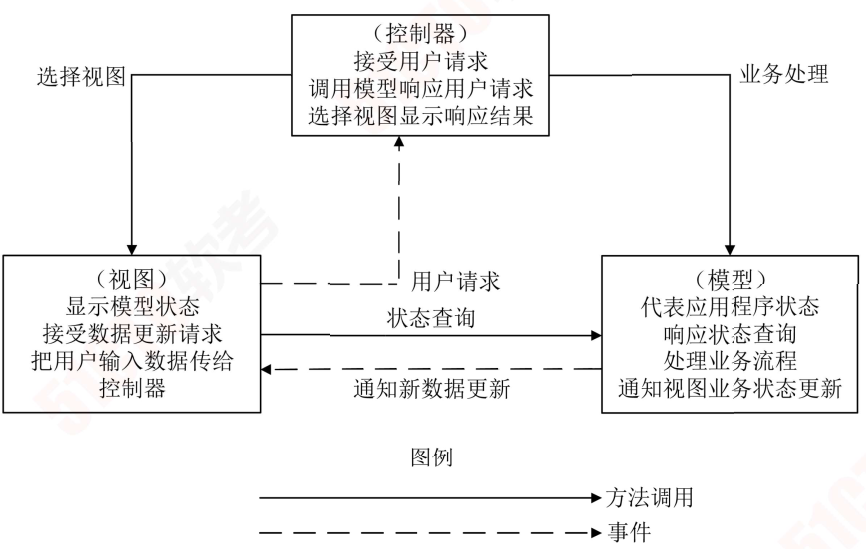

使用 MVC模式来设计表现层，可以有以下的优点：

1. 允许多种用户界面的扩展。
2. 易于维护。
3. 易于构建功能强大的用户界面。
4. 增加应用的可拓展性、强壮性、灵活性。

#### MVP（Model-View-Presenter）模式

-  Model提供数据
- View负责显示，
- Controller/Presenter负责逻辑的处理

MVP不仅仅避免了 View和 Model之间的耦合，还进一步降低了 Presenter对 View的依赖。

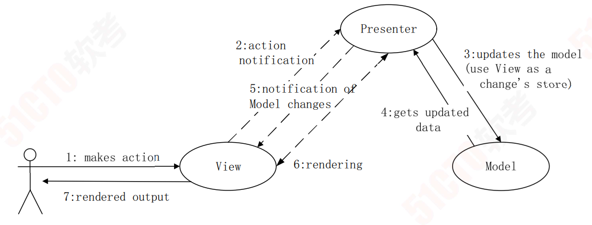

使用 MVP模式来设计表现层，可以有以下的优点：

- 模型与视图完全分离，可以修改视图而不影响模型。
- 所有的交互都发生在一个地方—Presenter内部，因此可以更高效地使用模型。
- 可以将一个 Presenter用于多个视图，而不需要改变 Presenter的逻辑。因为视图的变化总是比模型的变化频繁。
- 如果把逻辑放在 Presenter中，就可以脱离用户接口来测试这些逻辑（单元测试）。

#### MVVM（Model-View-View Model）模式

MVVM和 MVC、MVP类似，主要目的都是为了实现视图和模型的分离。

不同的是 MVVM中， View与 Model的交互通过 ViewModel来实现，也就是 View和 Model不能直接通信，两者的通信只能通过 ViewModel来实现。

ViewModel是 MVVM的核心，通过 DataBinding实现 View与 Model之间的双向绑定，其内容包括数据状态处理、数据绑定及数据转换。

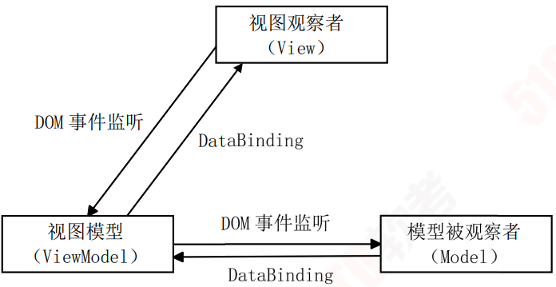

### 中间层框架设计

#### 业务逻辑层组件设计

业务逻辑层组件分为两个部分：

1. 接口
2. 实现类

接口用于定义业务逻辑组件，定义业务逻辑组件必须实现的方法是**整个系统运行的核心**。

通常按模块来设计业务逻辑组件，每个模块设计一个业务逻辑组件，并且每个业务逻辑组件以多个数据访问对象（Data Access Object，DAO）组件作为基础，从而实现对外提供系统的业务逻辑服务。

#### 业务逻辑层工作流设计

工作流管理联盟（Workflow Management Coalition，WFMC）将工作流定义为：**业务流程的全部或部分自动化**，在此过程中，**文档、信息或任务按照一定的过程规则流转**，实现组织成员间的协调工作以达到业务的整体目标。

工作流参考模型包括的组件：

1. 过程定义工具
2. 工作流引擎
3. 工作流客户端应用
4. 相关应用
5. 管理与监视工具  

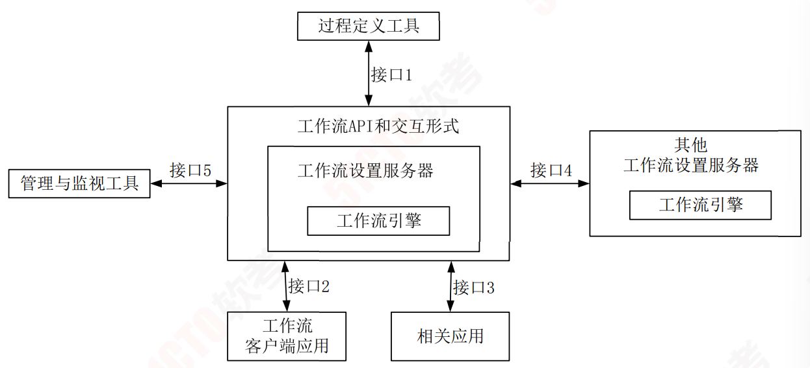

#### 业务逻辑层实体设计

逻辑层实体提供**对业务数据及相关功能（在某些设计中）的状态编程访问**。业务逻辑层实体可以使用具有复杂架构的数据来构建，这种数据通常来自数据库中的多个相关表。

业务逻辑层实体数据可以作为业务过程的部分 I/O参数传递。

业务逻辑层实体是可序列化的，以保持它们的当前状态。

#### 业务逻辑层框架

业务逻辑框架位于系统架构的中间层，是实现系统功能的核心组件。

采用容器的形式，便于系统功能的开发、代码重用和管理。

在业务容器中，业务逻辑是按照 Domain Model-Service-Control思想来实现的。其中：

1. Domain Model是仅仅包含业务相关的属性的领域层业务对象。
2. Service是业务过程实现的组成部分，是应用程序的不同功能单元，通过在这些服务之间定义良好的接口和契约联系起来。
3. Control服务控制器，是服务之间的纽带，不同服务之间的切换就是通过它来实现的。

### 数据访问层设计

#### 数据访问模式

数据访问模式有 5种：

1. ##### 在线访问

   最常用的方式。访问占用一个数据库连接，读取数据，每个数据库操作都会通过这个连接不断地与后台的数据源进行交互

2. ##### Data Access Object

   DAO是标准 J2EE设计模式，这种方式**将底层数据访问操作与高层业务逻辑分离开**。

   一个典型的 DAO实现通常会有一个 DAO工厂类、一个 DAO接口、一个实现了DAO接口的具体类、数据传输对象。

3. ##### Data Transfer Object

   TO属于 EJB设计模式之一。DTO是一组对象或容器，需要**跨越不同的进程或是网络的边界来传输数据**。

4. ##### 离线数据模式

   离线数据模式是以数据为中心，数据从数据源获取之后，将**按照某种预定义的结构存放在系统中，成为应用的中心**。这种方式对数据的各种操作**独立于各种与后台数据源之间的连接或是事务**。

5. ##### 对象/关系映射（Object/Relation Mapping）

   利用工具或平台能够帮助**将应用程序中的数据转换成关系型数据库中的记录**；

   或是**将关系数据库中的记录转换成应用程序中代码便于操作的对象**。

#### 工厂模式在数据访问层的应用

工厂模式定义一个用于创建对象的接口，让子类决定实例化哪一个类。工厂方法使一个类的实例化延迟到其子类。这里可能会处理对多种数据库的操作，因此，需要首先定义一个操纵数据库的接口，然后根据数据库的不同，由类工厂决定实例化哪个类。

#### ORM，Hibernate与 CMP2.0设计思想

ORM（Object-Relation Mapping）**在关系型数据库和对象之间作一个映射**，这样，在具体操纵数据库时，就不需要再去和复杂的 SQL语句打交道，只要像平时操作对象一样操作即可。

Hibernate是一个功能强大，可以有效地进行数据库数据到业务对象的 O/R映射方案。

Hibernate推动了基于普通 Java对象模型，用于映射底层数据结构的持久对象的开发。

#### XML Schema

XML Schema 用来描述 XML文档合法结构、内容和限制，提供丰富的数据类型。

事务处理设计

事 务必须 服 从 ISO/IEC所 制定的 ACID原 则。 

1. ##### ACID是 原子性（ Atomicity）

   事务的原子性表示事务执行过程中的**任何失败都将导致事务所做的任何修改失效。**

2. ##### 一 致性（Consistency）

   一致性表示当事务执行失败时，所有被该事务**影响的数据都应该恢复到事务执行前的状态**。

3. ##### 隔离性（Isolation）

   隔离性表示在事务执行过程中对数据的修改，**在事务提交之前对其他事务不可见。**

4. ##### 持久性（Durability）

   持久性表示已提交的数据在事务执行失败时，数据的状态都应该正确。

#### 连接对象管理设计

建立一个数据库连接池，提供一套高效的连接分配、使用策略，保证了数据库连接的有效复用。

####  数据架构规划与设计

##### 数据库设计与类的设计融合

对类和类之间关系的正确识别是数据模型的关键所在。

好模型的目标是将工程项目整个生存期内的花费减至最小，同时也会考虑到随时间的推移系统将可能发生的变化，因而设计时也要考虑能适应这些变化。

##### 数据库设计与 XML设计融合

XML文档的存储方式有两种：

1. 基于文件的存储方式
2. 数据库存储方式

###  物联网层次架构设计

#### 感知层

用于识别物体、采集信息。

感知层包括：

1. 二维码标签和识读器
2. RFID标签和读写器
3. 摄像头
4. GPS
5. 传感器
6. M2M终端
7. 传感器网关

主要功能：

1. 识别对象
2. 采集信息
3. 与人体结构中皮肤和五官的作用类似

#### 网络层

用于传递信息和处理信息。

网络层包括：

1. 通信网与互联网的融合网络
2. 网络管理中心
3. 信息中心
4. 智能处理中心

网络层将感知层获取的信息进行传递和处理，类似于人体结构中的神经中枢和大脑。

#### 应用层

实现广泛智能化。

应用层是物联网与行业专业技术的深度融合，结合行业需求实现行业智能化，这类似于人们的社会分工。

## 云原生架构设计理论与实践第

### 云原生架构内涵

云原生架构是基于云原生技术的**一组架构原则**和**设计模式**的集合，旨在将云应用中的**非业务代码部分进行最大化地剥离**，从而**让云设施接管应用中原有的大量非功能特性**（如弹性、韧性、安全、可观测性、灰度等），**使业务不再有非功能性业务中断困扰**的同时，具备**轻量**、**敏捷**、**高度自动化**的特点。

#### 特点

基于云原生架构的应用特点包括：

1. ##### 代码结构发生巨大变化

   不再需要掌握文件及其分布式处理技术，不再需要掌握各种复杂的网络技术，简化让业务开发变得更敏捷、更快速。

2. ##### 非功能性特性大量委托给云原生架构来解决

   比如高可用能力、容灾能力、安全特性、可运维性、易用性、可测试性、灰度发布能力等。

3. ##### 高度自动化的软件交付

   基于云原生的自动化软件交付可以把应用自动部署到成千上万的节点上。

#### 云原生的原则

1. ##### 服务化原则

   通过服务化架构**把不同生命周期的模块分离出来，分别进行业务迭代。**

2. ##### 弹性原则

   弹性是指系统的**部署规模可以随着业务量的变化而自动伸缩**。

3. ##### 可观测原则

   通过日志、链路跟踪和度量等手段，使得**多次服务调用的耗时、返回值和参数都清晰可见**。

4. ##### 韧性原则

   软件所依赖的软硬件组件出现各种异常时，**软件表现出来的抵御能力**。

5. ##### 所有过程自动化原则

   让自动化工具理解交付目标和环境差异，实现**整个软件交付和运维的自动化。**

6. ##### 零信任原则

   不应该信任网络内部和外部的任何人/设备/系统，需要**基于认证和授权重构访问控制的信任基础**。

7. ##### 架构持续演进原则

   架构具备持续演进能力。

#### 主要架构模式

##### 服务化架构模式

要求以应用模块为**颗粒度划分一个应用软件**，**以接口契约**（例如 IDL）定义彼此业务关系，**以标准协议（HTTP、gRPC等）确保彼此的互联互通**，结合领域模型驱动（Domain Driven Design，DDD）、测试动开发（Test Driven Design，TDD）、容器化部署提升每个接口的代码质量和迭代速度。

##### Mesh化架构模式

Mesh化架构是**把中间件框架（如 RPC、缓存、异步消息等）从业务进程中分离**，让中间件 SDK与业务代码进一步解耦，从而使得**中间件升级对业务进程没有影响**，甚至迁移到另外一个平台的中间件也对业务透明。

##### Serverless模式

**业务流量到来/业务事件发生时，云会启动或调度一个已启动的业务进程进行处理，处理完成后云自动会关闭/调度业务进程，等待下一次触发**。

开发者不用关心应用运行地点、操作系统、网络配置、CPU性能等，将应用的整个运行都委托给云。

Serverless模式适合事件驱动的数据计算任务、计算时间短的请求/响应应用、没有复杂相互调用的长周期任务。

##### 存储计算分离模式

分布式环境中的 CAP困难主要是针对有状态应用，由于一致性（Consistency，C），可用性（Availability，A），分区容错性（Partition Tolerance，P）三者无法同时满足，最多满足其中两个。所以**无状态应用不存在一致性这个维度，可以获得很好的可用性和分区容错性，因而获得更好的弹性**。

##### 分布式事务模式

由于业务需要访问多个微服务，所以会带来分布式事务问题，否则数据就会出现不一致。因此架构师需要根据不同的场景选择合适的**分布式事务模式**，常用的有：

1. ###### XA模式（传统采用 XA模式）

   由于 **XA规范是实现分布式事务处理的标准**，通常采用两阶段提交（2 Prepare Commit，2PC）的方法，具有**很强的一致性**，但是由于需要两次网络交互，所以**性能差**。

2. ##### 基于消息的最终一致性（BASE）

   在可用性和一致性相冲突的情况下，为了权衡二者，BASE提出只要满足**基本可用（BA）和最终一致性（E）**，接受数据的软状态或未确定状态（S），来优先实现性能，所以这类系统通常具备很高的性能。但正是由于应用的特点，选择可用性和一致性的妥协方案，导致通用性有限。

3. #####  TCC模式

   采用 **Try-Confirm-Cancel二阶段模式**，事务隔离性可控，高效，但需要应用代码将业务模型拆成二阶段，所以对业务侵**入性强**，设计**开发维护等成本很高**。

4. #####  SAGA模式

   **每个正向事务都对应一个补偿事务，若正向事务执行失败，则会执行补偿事务进行回滚。**所以**开发维护成本高**。

5. ##### 开源项目 SEATA的 AT模式

   它将 TCC模式中的二阶段委托给底层代码框架，并且取消了行锁，所以非常高性能且无代码开发工作量，且可以自动执行回滚操作，但存在一些使用场景限制。

#### 可观测架构

可观测架构包括：

1.  Logging

   提供多个级别跟踪，例如 INFO/ DEBUG/WARNING/ERROR

2. Tracing

   收集一个请求从前端到后端的访问日志聚合，形成**完整调用链路跟踪**

3. Metrics，

   **提供对系统量化的多维度度量**，包括并发度、耗时、可用时长、容量等。

#### 事件驱动架构

事件驱动架构是一种应用/组件间的集成架构模式。

事件驱动架构（Event Driven Architecture，EDA）是一种应用/组件间的集成架构模式。

适用于增强服务韧性、数据变化通知、构建开放式接口、事件流处理、命令查询的责任分离（Command Query Responsibility Segregation，CQRS）把对服务状态有影响的命令用事件来发起，而对服务状态没有影响的查询才使用同步调用的 API接口等。  

#### 典型的云原生架构反模式

常见的云原生反模式有：

1. 庞大的单体应用：缺乏依赖隔离，代码耦合，责任和模块边界不清晰，模块间接口缺乏治理，变更影响扩散，不同模块间的开发进度和发布时间要求难以协调，一个子模块不稳定导致整个应用都变慢，扩容时只能整体扩容而不能对达到瓶颈的模块单独扩容等。
2. 单体应用“硬拆”为微服务：强行把耦合度高、代码量少的模块进行服务化拆分；拆分后服务的数据是紧密耦合的；拆分后成为分布式调用，严重影响性能。
3. 缺乏自动化能力的微服务：人均负责模块数上升，人均工作量增大，也增加了软件开发成本。

### 云原生架构相关技术

容器技术

**容器作为标准化软件基础单元**，它将应用及其所有依赖项打包发布，由于依赖项齐备，应用不再受环境限制，在不同计算环境间快速、可靠地运行。

容器部署模式与其他模式的比较：

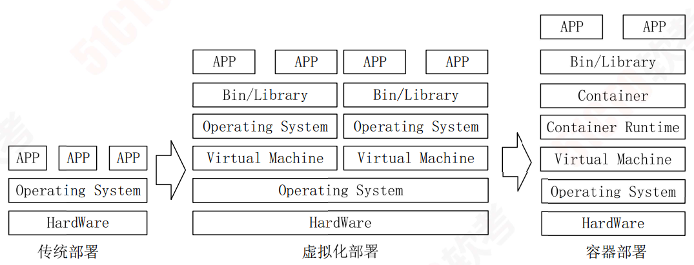

#### 容器编排技术

容器编排技术包括：

1. 资源调度
2. 应用部署与管理
3. 自动修复
4. 服务发现与负载均衡
5. 弹性伸缩
6. 声明式 API
7. 可扩展性架构
8. 可移植性

#### 微服务

微服务模式将后端单体应用拆分为松耦合的多个子应用，每个子应用负责一组子功能。这些子应用称为“微服务”，多个“微服务”共同形成了一个物理独立但逻辑完整的分布式微服务体系。这些微服务相对独立，通过解耦研发、测试与部署流程，提高整体迭代效率。

微服务设计约束如下：

1. 微服务**个体约束**：微服务应用的功能在业务领域划分上应是相互独立的。
2. 微服务与微服务之间的**横向关系**：在合理划分好微服务间的边界后，从**可发现性和可交互性处理微服务间的横向关系**。可发现性是指当服务 A发布和扩/缩容的时候，依赖服务 A的服务B在不重新发布的前提下，能够自动感知到服务 A的变化。可交互性是指服务 A采用什么样的方式可以调用服务 B。
3. 微服务与数据层之间的**纵向约束**：提倡数据存储隔离（Data Storage Segregation，DSS）原则**，对于数据的访问都必须通过相对应的微服务提供的 API来访问**。
4. 全局视角下的微服务**分布式约束**：高效运维整个系统，从技术上实现**全自动化的 CI/CD流水线**满足对开发效率的诉求，并在这个基础上支持蓝绿、金丝雀等不同发布策略，以满足对业务发布稳定性的诉求。

#### 无服务器技术

无服务器技术的特点：

1. ##### 全托管的计算服务

   客户只需要编写代码构建应用，无须**关注同质化的、负担繁重的基于服务器等基础设施的开发、运维、安全、高可用等工作**。

2. ##### 通用性

   结合云 BaaS（后端云服务）API的能力，能够**支撑云上所有重要类型的应用**。

3. ##### 自动弹性伸缩

   让用户**无须为资源使用提前进行容量规划**。

4. ##### 按量计费

   让企业的使用成本有效降低，**无须为闲置资源付费**。

无服务器技术的关注点是：

1. 计算资源弹性调度（容错、资源利用率、性能、数据驱动）
2. 负载均衡和流控
3. 安全性。

#### 服务网格（Service Mesh）

服务网格旨在将那些微服务间的**连接、安全、流量控制和可观测**等通用功能下沉为平台基础设施，实现应用与平台基础设施的解耦。

服务 A调用服务 B的所有请求，都被其下的服务代理截获，代理服务 A完成到服务 B的服务发现、熔断、限流等策略，而这些策略的总控是在控制平面（Control Plane）上配置。

服务网格的主要技术：

1. Istio
2. Linkerd
3. Consul。

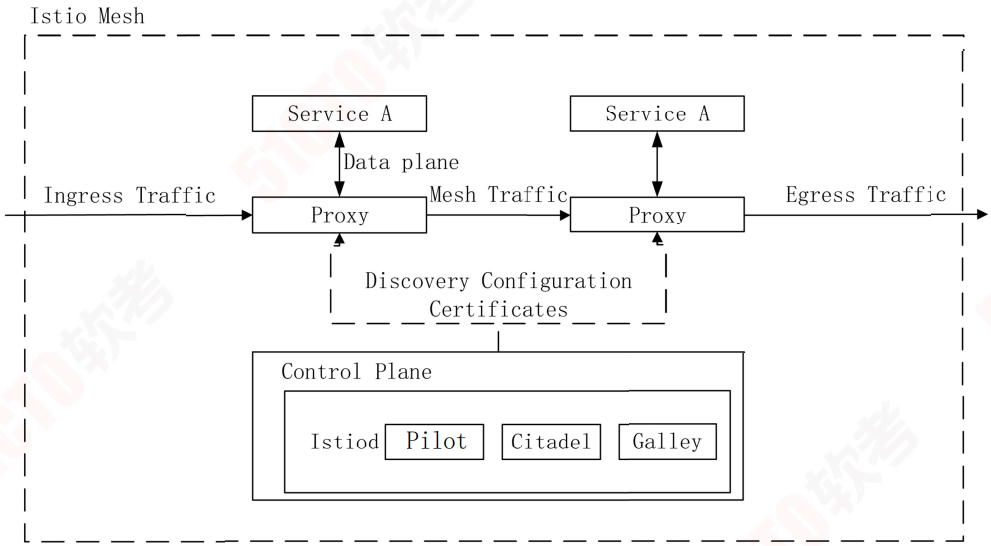

## 面向服务架构设计理论与实践  

### SOA 的相关概念

从软件的基本原理定义，可以认为 SOA是一个组件模型，它将应用程序的不同功能单元（称为服务）通过这些服务之间定义良好的接口和契约联系起来。接口是采用中立的方式进行定义的，它应该独立于实现服务的硬件平台、操作系统和编程语言。这使得构建在各种这样的系统中的服务可以一种统一和通用的方式进行交互。

业务流程与业务流程执行语言（Business Process Execution Language，BPEL）是指为了实现某种业务目的行为所进行的流程或一系列动作。使用 BPEL，用户可以通过组合、编排和协调 Web服务自上而下地实现面向服务的体系结构。BPEL目前用于整合现有的 Web Services，将现有的 Web Services按照要求的业务流程整理成为一个新的 Web Services，在这个基础上，形成一个从外界看来和单个 Service一样的 Service。

### SOA 的发展历史

#### 发展过程

1. **萌芽阶段**

   这种广泛使用的 XML，允许组织定义文档的元数据，实现企业内部和企业之间的电子数据交换，规定了服务之间以及服务内部数据交换的格式和结构。

2. **标准化阶段**

   国际标准和规范：

   1. 简单对象访问协议（Simple Object Access Protocol， SOAP）
   2. Web服务描述语言（Web Services Description Language，WSDL）
   3. 通用服务发现和集成协议（Universal Description, Discovery and Integration，UDDI）。

3. **成熟应用阶段**

   3个重量级规范—SCA、SDO、WS-Policy。

   SCA和 SDO构成了 SOA编程模型的基础，而 WS-Policy建立了 SOA组件之间安全交互的规范。

#### SOA与微服务的区别

**微服务相比于 SOA更加精细**，微服务更多地以独立的进程的方式存在，互相之间并无影响

**微服务提供的接口方式更加通用化**，例如 HTTP RESTful方式，各种终端都可以调用，无关语言、平台限制。

**微服务更倾向于分布式去中心化的部署方式**，在互联网业务场景下更适合。

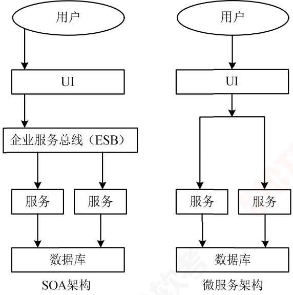

### SOA 的参考架构

以服务为中心的企业集成架构，它可划分为 6大类：

##### 业务逻辑服务（Business Logic Service）

用于实现业务逻辑的服务和执行业务逻辑的能力。

其中包括：

- 业务应用服务（Business Application Service）
- 业务伙伴服务（Partner Service）
- 应用和信息资产（Application and Information Asset）。

##### 控制服务（Control Service）

包括实现人（People）、流程（Process）和信息（Information）集成的服务，以及执行这些集成逻辑的能力。

##### 连接服务（Connectivity Service）

通过提供企业服务总线，实现分布在各种架构元素中服务间的连接性。

##### 业务创新和优化服务（Business Innovation and Optimization Service）

用于监控业务系统运行时服务的业务性能，并通过及时了解到的业务性能和变化，采取措施适应变化的市场。

##### 开发服务（Development Service）

贯彻整个软件开发生命周期的开发平台，从需求分析到建模、设计、开发、测试和维护等全面的工具支持。

##### IT服务管理（IT Service Management）

支持业务系统运行的各种基础设施管理能力或服务，如安全服务、目录服务、系统管理和资源虚拟化。

###  SOA 主要协议和规范

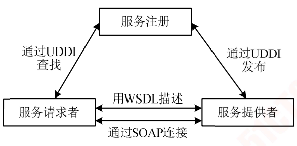

Web服务最基本的协议包括：

1. #####  UDDI协议

   统一描述、发现和集成协议。包含了服务描述与发现的标准规范，它使得商业实体能够彼此发现；定义它们怎样在 Internet上互相作用，并在一个全球的注册体系架构中共享信息。

2. ##### Web服务描述语言（Web Services Description Language，WSDL）

   一个用来描述 Web服务和说明如何与 Web服务通信的 XML语言。

   描述了 Web服务的 3个基本属性。

   1. 服务做些什么—**服务所提供的操作（方法）**。
   2. 如何访问服务—**和服务交互的数据格式以及必要协议**。
   3. 服务位于何处—**协议相关的地址**，如 URL。

3. ##### SOAP

   在分散或分布式的环境中**交换信息的简单的协议**，是一个基于XML的协议。

#### REST规范

为了让不同的软件或者应用程序在任何网络环境下都可以进行信息的互相传递。微服务对外就是以 REST API的形式暴露给调用者。RESTful即 REST形式的，是对遵循REST设计思想同时满足设计约束的一类架构设计或应用程序的统称，这一类都可称为 RESTful，可以理解为资源表述性状态转移：

- 资源：将互联网中一切暴露给客户端的事物都可以看作是一种资源。
- 表述：REST中用表述描述资源在 Web中某一个时间的状态。
- 状态转移：
  1. 应用状态—对某个时间内用户请求会话相关信息的快照，保存在客户端。
  2. 资源状态—在服务端保存，是对某个时间资源请求表述的快照。
- 超链接：通过在页面中嵌入链接和其他资源建立联系。

### SOA 设计的标准要求

文档标准化。SOA服务具有平台独立的自我描述 XML文档。Web服务描述语言是用于描述服务的标准语言。

通信协议标准。SOA服务用消息进行通信，该消息通常使用 XML Schema来定义（也称作 XML Schema Definition，XSD）。

应用程序统一登记与集成。在一个企业内部，SOA服务通过一个扮演目录列表（Directory Listing）角色的登记处（Registry）来进行维护。应用程序在登记处（Registry）寻找并调用某项服务。统一描述、定义和集成是服务登记的标准。

服务质量（QoS）主要包括：

1. 可靠性：服务消费者和服务提供者之间传输文档时的传输特性（且仅仅传送一次、最多传送一次、重复消息过滤、保证消息传送）。
2. 安全性：Web服务安全规范用来保证消息的安全性。
3. 策略：服务提供者有时候会要求服务消费者与某种策略通信。例如，服务提供商可能会要求消费者提供 Kerberos安全标示才能取得某项服务。
4. 控制：在 SOA中，进程是使用一组离散的服务创建的。BPEL4WS或者 WSBPEL（Web Service Business Process Execution Language）是用来控制这些服务的语言。
5. 管理：针对运行在多种环境下的所有服务，必须有一个统一管理系统，以便系统管理员能够有效管理。任何根据 WSDM实现的服务都可以由一个 WSDM适应（WSDM-compliant）的管理方案来管理。

### SOA 的作用与设计原则

SOA的主要作用：打破信息孤岛，把应用和资源转换成服务。以及把这些服务变成标准的服务，形成资源的共享。

SOA的设计原则主要有：

1.  无状态。以避免服务请求者依赖于服务提供者的状态。
2. 单一实例。以高内聚的实现方法，来避免功能冗余。
3. 明确定义的接口。服务的接口由 WSDL定义，用于指明服务的公共接口与其内部专用实现之间的界线。
4. 自包含和模块化。服务封装了那些在业务上稳定、重复出现的活动和组件，实现**服务的功能实体是完全独立自主的**，**独立进行部署**、**版本控制**、**自我管理**和**恢复**。
5. 粗粒度。服务数量不应该太大，依靠消息交互而不是远程过程调用（Remote Procedure Call， RPC），通常消息量较大，但是服务之间的交互频度较低。
6. 服务之间的松耦合性。服务使用者看到的是服务的接口，其位置、实现技术和当前状态等对使用者是不可见的，服务私有数据对服务使用者是不可见的。
7. 重用能力。服务应该是可以复用的。
8. 互操作性、兼容和策略声明。为了确保服务规约的全面和明确，利用策略来定义可配置的互操作语义，来描述特定服务的期望、控制其行为。利用策略声明确保服务期望和语义兼容性方面的完整和明确。

### SOA 的设计模式

#### 服务注册表模式

服务注册表支持驱动 SOA治理的服务合同、策略和元数据的开发、发布和管理。

1. 服务注册：应用开发者，也叫服务提供者，向注册表公布它们的功能。
2. 服务位置：也就是服务应用开发者，帮助它们查询注册服务，寻找符合自身要求的服务。
3. 服务绑定：服务的消费者利用检索到的服务合同来开发代码，开发的代码将与注册的服务绑定、调用注册的服务以及与它们实现互动。

#### 企业服务总线模式

企业服务总线模式提供**一种标准的软件底层架构，各种程序组件能够以服务单元的方式“插入”到该平台上运行**，并且**组件之间能够以标准的消息通信方式来进行交互。**其核心功能如下：

1. **提供位置透明性的消息路由和寻址服务**。程序组件之间无须关注对方的路由和寻址。
2. 提供**服务注册**和**命名的管理功能**。
3. 支持**多种消息传递范型**（如请求/响应、发布/订阅等）。
4. 支持多种可以**广泛使用的传输协议**。
5. 支持**多种数据格式及其相互转换**。
6. 提供**日志和监控**功能。

#### 微服务模式

微服务架构将一个大型的单个应用或服务拆分成多个微服务，可扩展单个组件而不是整个应用程序堆栈，从而满足服务等级协议。

微服务架构围绕业务领域将服务进行拆分，每个服务可以独立进行开发、管理和迭代，彼此之间使用统一接口进行交流，实现了在分散组件中的部署、管理与服务功能，使产品交付变得更加简单，从而达到有效拆分应用，实现敏捷开发与部署的目的。

微服务模式的特点如下：

1. 复杂应用解耦：微服务架构将单一模块应用分解为多个微服务，同时保持总体功能不变。
2. 独立：微服务在系统软件生命周期中是独立开发、**测试及部署的**。
3. 技术选型灵活：微服务架构下系统应用的**技术选型是去中心化的**，每个开发团队可根据自身应用的业务需求发展状况选择合适的体系架构与技术。
4. 容错：由于各个微服务相互独立，**故障会被隔离在单个服务中**，并且系统**其他微服务可通过重试、平稳退化等机制实现应用层的容错，从而提高系统应用的容错性**。
5. 松耦合，易扩展：微服务架构中每个服务之间都是松耦合的，可以**根据实际需求实现独立扩展，体现微服务架构的灵活性**。

#### 微服务架构模式方案

微服务架构模式方案主要包括：

1. 聚合器微服务：聚合器充当流程指挥者，调用多个微服务实现系统应用程序所需功能。
2. 链式微服务：客户端或服务在收到请求后，会发生多个服务间的嵌套递归调用，返回经过合并处理的响应。
3. 数据共享微服务：该模式适用于在单体架构应用到微服务架构的过渡阶段，服务之间允许存在强耦合关系，例如存在多个微服务共享缓存与数据库存储的现象。
4.  异步消息传递微服务：对于一些不必要以同步方式运行的业务逻辑，可以使用消息队列代替 REST实现请求、响应，加快服务调用的响应速度。

#### 微服务架构面临的问题与挑战

1. 服务发现与服务调用链跟踪变得困难。
2. 很难实现传统数据库的强一致性，转而追求最终一致性。

### 构建 SOA 架构时应该注意的问题

1. 原有系统架构中的集成需求包括：

   1. 应用程序集成的需求
   2. 终端用户界面集成的需求
   3. 流程集成的需求
   4. 已有系统信息集成的需求

2. 服务粒度的控制以及无状态服务的设计的表述如下

   1. 服务粒度的控制

      对于将暴露在整个系统外部的服务推荐使用粗粒度的接口，而相对较细粒度的服务接口通常用于企业系统架构的内部。

   2. 无状态服务的设计

      SOA系统架构中的具体服务应该都是**独立的、自包含的请求**，在实现这些服务的时候不需要前一个请求的状态，也就是说**服务不应该依赖于其他服务的上下文和状态**，即 SOA架构中的服务应该是无状态的服务。

### SOA 实施的过程

 SOA解决方案：

1. 尽量选择能进行全局规划的方案。
   1. 选择时充分考虑企业自身的需求。
   2. 从平台、实施等技术方面进行考察。
2. 业务流程分析主要关注：
   1. 建立服务模型：
      1. 自顶向下分解法
      2. 业务目标分析法
      3. 自底向上分析法
   2. 建立业务流程
      1. 建立业务对象（实体、过程、事件等业务对象）
      2. 建立服务接口
      3. 建立服务流程

## 嵌入式系统架构设计理论与实践  

#### 嵌入式系统发展历程

| 发展历程                         | 硬件                                 | 软件                 | 主要特点                                                     |
| -------------------------------- | ------------------------------------ | -------------------- | ------------------------------------------------------------ |
| 单片微型计算机（SCM）            | 单片机                               | 无操作系统汇编语言   | 结构和功能相对单一处理效率低存储容量十分有限几乎没有用户接口 |
| 微控制器（MCU）                  | 单片机嵌入式微处理器外围电路接口电路 | 以简单操作系统为核心 | 微处理器、微控制器种类繁多通用性比较弱系统开销小，处理效率高智能化控制能力突出 |
| 片上系统（SoC）                  | 嵌入式微处理器                       | 嵌入式操作系统       | 嵌入式系统兼容性好操作系统内核小处理效率高                   |
| 以 Internet为基础的嵌入式系统    | 嵌入式微处理器                       | 嵌入式操作系统       | 微处理器集成网络接口应用域网络环境中                         |
| 智能化、云技术推动下的嵌入式系统 | 微型传感器智能服务设备               | —                    | 低能耗，高速度，高集成，高可信，适应环境广                   |

### 嵌入式系统硬件

#### 传统嵌入式系统

传统嵌入式系统主要硬件包括：

1. 微处理器：微控制器（MCU），微处理器（MPU）。
2. 存储器：RAM、ROM。
3. 总线：内总线，外总线。
4. 定时器/计数器（Timer）。
5. 看门狗（WatchDog）
6. I/O接口：串口，网络，USB，JTAG。
7. 外部设备：UART，LED。

#### 嵌入式处理器的分类

嵌入式处理器可以分为：

1. ##### 微处理器（Micro Processor Unit，MPU）。

   是体积小，重量轻，成本低，可靠性高，但技术保密性差。

2. ##### 微控制器（Micro Control Unit，MCU）

   单片化，体积小，功耗低，成本低，可靠性更高。

3. ##### 信号处理器（Digital Signal Processor，DSP）

   系统结构和指令采用特殊设计，通常采用哈佛结构，编译效率高，指令执行速度也高。

4. ##### 图形处理器（Graphics Processing Unit，GPU）

   专注于浮点运算，弥补了 CPU运算速度不足。

5. ##### 片上系统（System on Chip，SoC）

   采用了片内再编程技术，可使片上系统内硬件的功能像软件一样通过编程来配置，从而可以实时地进行灵活而方便的修改和开发。

存储器存

储器就是一种存储程序和数据用的时序逻辑电路。

存储器具有如下分类：

1. ##### 随机存取存储器（Random Access Memory，RAM）

   特点：一旦系统断电，存放在里面的所有数据和程序都会自动清空掉，并且再也无法恢复。

   根据组成元件的不同，RAM内存又可分为以下 18种：

   1. 动态随机存取存储器（DRAM）；
   2. 静态随机存取存储器（SRAM）；
   3. 视频内存（VRAM）；
   4. 快速页切换模式动态随机存取存储器（FPM DRAM）；
   5. 延伸数据输出动态随机存取存储器（EDO DRAM）；
   6. 爆发式延伸数据输出动态随机存取存储器（BEDO DRAM）； 
   7. 多插槽动态随机存取存储器（MDRAM）；
   8. 窗口随机存取存储器（WRAM）；
   9. 高频动态随机存取存储器（RDRAM）；
   10. 同步动态随机存取存储器（SDRAM）；
   11. 同步图形随机存取存储器（SGRAM）；
   12. 同步爆发式静态随机存取存储器（SB SRAM）；
   13. 管线爆发式静态随机存取存储器（PB SRAM）；
   14. 二倍速率同步动态随机存取存储器（DDR SDRAM）；
   15. 同步链环动态随机存取存储器（SLDRAM）；
   16. 同步缓存动态随机存取存储器（CDRAM）；
   17. 第二代同步双倍速率动态随机存取存储器（DDRII）；
   18. 直接内存总线动态随机存取存储器（DRDRAM）。

2. ##### 只读存储器（Read Only Memory，ROM）

   ROM在元件正常工作的情况下，其中的代码数据将永久保存，并且不能够进行修改。ROM一般应用于 PC系统程序码和主机板 BIOS上。

   ROM可以分为以下 5种：

   掩模型只读存储器（MASK ROM）；

   可编程只读存储器（PROM）；

   可擦可编程只读存储器（EPROM）；

   电可擦可编程只读存储器（EEPROM）；

   快闪存储器（Flash Memory）。

#### 总线

总线是功能部件间传输信息的公共通信干线。

总线的拓扑结构有等 5种：

1. 星型
2. 树状
3. 环型
4. 总线型
5. 交叉开关型

总线的类型可以按照计算机所传输的信息种类、按连接部件进行划分。

1. 按照计算机所传输的信息种类可以分为：
   1. 数据总线：用于处理器与 RAM间传输待处理和待存储的数据。
   2. 地址总线：用于传输 RAM中存储数据的地址。
   3. 控制总线：用于传输处理器控制单元信号到周边设备。
2. 按连接部件分类。
   1. 片内总线：内部总线，连接 ALU、寄存器、指令部件等芯片内部元件。
   2. 系统总线：内部总线，又称板级总线，连接微控制器/处理器，主存，I/O接口。
   3. 局部总线：内部总线，连接少量组件用于交换数据。
   4. 通信总线：外部总线，又称外设总线，连接外部设备或外部系统。

#### 看门狗

看门狗为嵌入式系统提供必需的系统恢复能力，在系统发生软件问题和程序跑飞时重新启动系统。

基本原理是由计数器自动计数，程序定期将其重置，如果系统卡死或程序跑飞，计数器溢出，进入中断处理，在设定时间间隔内，系统保留状态后复位重启。

### 嵌入式系统软件

#### 嵌入式操作系统的定义及特点

嵌入式操作系统（Embedded Operating System，EOS）是指用于嵌入式系统的操作系统。

与通用的操作系统相比，嵌入式操作系统具有：

- 可剪裁性
- 可移植性
- 强实时性
- 强紧凑性
- 高质量代码
- 强定制性
- 标准接口
- 强稳定性
- 弱交互性
- 强确定性
- 操作简捷
- 方便
- 较强的硬件适应性
- 可固化性

#### 嵌入式系统的架构

嵌入式操作系统分为两类:

1. 面向控制、通信领域
2. 面向消费电子产品

嵌入式操作系统的架构如图：

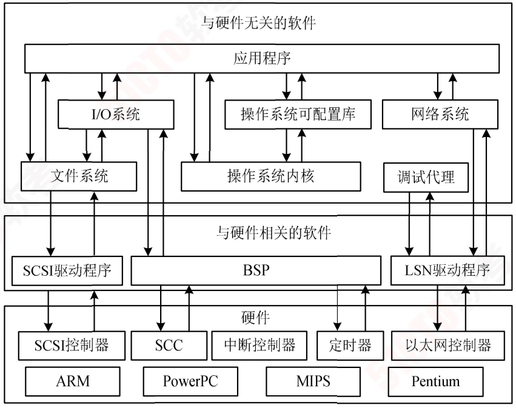

#### 嵌入式操作系统的基本功能

#### 操作系统内核架构

1. ##### 宏内核

   用于管理用户程序和硬件间的系统资源，**在宏内核中用户服务和内核服务在同一空间中实现**，代码耦合度非常高，内核的功能组件代码可以互相调用。

2. ##### 微内核

   微内核管理所有系统资源，在微内核中**用户服务和内核服务在不同空间中实现**，系统结构清晰，代码量少。

#### 任务管理

任务是嵌入式操作系统调度最小单位，类似于计算机操作系统中进程的概念。

任务有 3种工作状态： 

1. ##### 执行状态

   任务获得处理机，程序在处理机中执行。

2. ##### 就绪状态

3. 任务已获得处理机以外资源，待获得处理机即可执行。

4. ##### 阻塞状态

   执行状态任务因等待事件发生无法执行而放弃处理机。

   嵌入式操作系统大都支持**优先级抢占调度算法**和**时间片轮转调度算法**。

   在实时系统的任务调度中，存在大量的实时调度方法，大致可以分为：

   1. 离线调度算法：系统运行前确定调度信息，如时间驱动，确定性，缺乏灵活性。
   2. 在线调度算法：系统运行中动态获得调度信息，如优先级驱动，灵活性较大。
   3. 抢占调度算法：运行任务可能被打断，更复杂，更耗资源。
   4. 非抢占调度算法：运行任务不被打断。
   5. 静态调度算法：任务优先级在设计时确定，不变化，简单，缺乏灵活性。
   6. 动态调度算法：任务优先级在运行中确定，不断变化，灵活，耗资源。实时调度算法中还有强实时调度算法，具体可以分为：
      1. 最早截止时间优先（Earliest Deadline First，EDF）调度算法：根据任务截止时间确定优先级，截止时间越早，其优先级越高。
      2. 最低松弛度优先（Least Laxity First，LLF）调度算法：根据任务紧急或松弛程度确定优先级，紧急程度越高，优先级越高。
      3. 单调速率（Rate Monotonic Scheduling，RMS）调度算法：根据任务周期确定有限期，周期越短，优先级越高。这种算法被认为是最优的。

5. ##### 存储管理

   目的：解决多个用户使用主存的问题。

   方法：

   1. 分区
   2. 分页
   3. 分段
   4. 段页式存储管理
   5. 虚拟存储管理

6. ##### 任务间通信

   任务间通信管理也是嵌入式操作系统的关键功能之一。它主要为操作系统的应用程序提供多种类型的数据传输、任务同步/异步操作等手段。

#### 嵌入式数据库

嵌入式数据库特点：

1. 嵌入式
2. 实时性
3. 移动性
4. 伸缩性

嵌入式数据库分类：

1. 按嵌入对象分为：
   1. 软件嵌入数据库
   2. 设备嵌入数据库
   3. 内存数据库
2. 按系统结构分为：
   1. 嵌入数据库
   2. 移动数据库
   3. 小型 C/S结构数据库。
3. 按存储位置分为：
   1. 基于内存的数据库系统：采用内存存储，属于实时事务最佳技术；
   2. 基于文件的数据库：以文件方式磁盘存储，安全性低；
   3. 基于网络的数据库：远程服务器存储，无须解析 SQL，支持更多 SQL操作，客户端小，便于代码重用。

#### 嵌入式数据库架构

数据库管理系统与嵌入式数据库对比

| 对比页   | 数据库管理系统               | 嵌入式数据库             |
| -------- | ---------------------------- | ------------------------ |
| 操作用户 | 允许非开发人员操作           | 只允许应用程序访问和控制 |
| 访问控制 | 数据与程序分离，便于访问控制 | 应用程序负责访问和控制   |
| 发布部署 | 独立安装、部署和管理         | 与应用程序一同发布       |

##### 基于内存的数据库系统。

典型产品是 eXtremeDB嵌入式数据库

特点：

1. 最小化资源消耗
2. 保持极小堆空间
3. 维持极小代码体积
4. 消除额外代码层
5. 提供动态数据结构本地支持

##### 基于文件的嵌入式数据库系统架构。

典型产品是 SQLite，

特点：

1. 开源的内嵌式关系型数据库
2. 集成在程序中，无须配置管理，服务器客户端同进程，简化管理，减少网络开销、对数据类型有独特处理。

##### 基于网络的嵌入式数据库系统架构

C/S架构的数据库、B/S架构的数据库以及云数据库等都属于这种类型。

#### 嵌入式数据库主要功能

除了具有与通用数据库相似的功能外，嵌入式数据库还具有的功能包括：

1. 足够高效的数据存储机制
2. 数据安全控制（锁机制）
3. 实时事务管理机制
4. 数据库恢复机制（历史数据存储）

#### 嵌入式中间件

嵌入式中间件是在嵌入式系统中处于嵌入式应用和操作系统之间层次的中间软件。

主要作用：

- 对嵌入式应用**屏蔽底层操作系统的异构性**。

常见功能：

1. 网络通信
2. 内存管理
3. 数据处理

典型的嵌入式中间件：

1. 消息中间件
2. 分布式对象中间件

#### 嵌入式系统软件开发环境

嵌入式系统软件开发环境的**特点**是：

1. 集成开发环境
2. 交叉开发
3. 开放式架构
4. 可扩展性
5. 可操作性
6. 可移植性
7. 可配置性
8. 实时性
9. 可维护性
10. 用户界面友好

### 嵌入式系统软件架构设计方法

#### 基于架构的软件设计开发方法（Architecture -Based Software Design，ABSD）

#### 属性驱动的软件设计方法（Attribute -Driven Design，ADD）

ADD是把一组质量属性（可用性、性能、安全性等）场景作为输入，利用对质量属性实现与架构设计之间的关系的了解（如体系结构风格、质量战术等）对软件架构进行设计的一种方法。

这种方法在满足质量属性的基础上建立模块分解过程，通过输入质量场景，利用质量属性战术实现架构设计。

采用 ADD方法进行软件开发 7个阶段：

1. 经历**评审**
2. 选择**驱动因子**
3. 选择**系统元素**
4. 选择**设计概念**
5. **实体化元素**和**定义接口**
6. **草拟视图**
7. 分析评价

#### 实时系统设计方法（Design Approach for Real -Time System，DARTS）

DARTS基于传统**结构化分析**方法，**扩展了行为建模**部分。

DARTS方法分为 5个部分：

1. 用实时结构化分析方法开发系统规范
2. 将系统划分为多个并发任务
3. 定义任务间接口
4. 设计每个任务
5. 设计过程的成果。

DARTS方法的优势如下： 

1. 强调将系统**分解为并发任务**，并提供确认任务的标准。
2. 提供定义**任务间接口的指南**。
3. 强调用任务**架构图的重要性**。
4. 提供从实时结构化分析规格到**实时结构化设计的转换**。

DARTS方法的不足如下：

1. DARTS使用信息隐藏技术封装数据存储，封装性不好。
2. 如果实时结构化分析阶段完成得不好，那么任务的结构化工作就会更加困难。

### 嵌入式系统软件架构实践

#### 鸿蒙操作系统

鸿蒙操作系统架构**采用了分布式设计理念**，实现了**分布式软总线**、**分布式设备系统的虚拟化**、**分布式数据管理**和**分布式任务调度** 4种分布式能力。

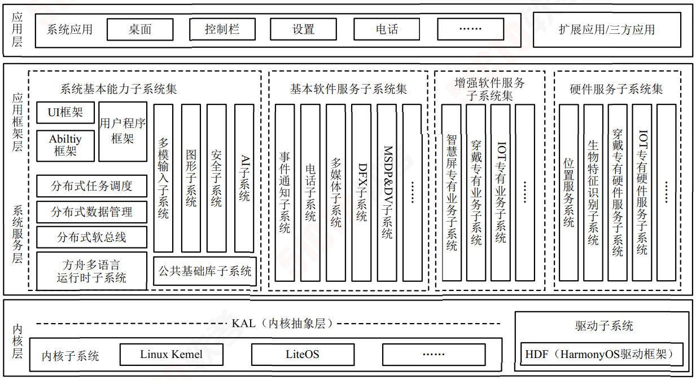

鸿蒙操作系统的架构是一种**层次式架构**。

1. ##### 内核层。

   内核层采用微内核设计，内核层中的内核抽象层屏蔽多内核差异，对上层提供基础内核能力，如进程/线程管理、内存管理、文件系统、网络管理、外设管理等。

   驱动子系统则提供统一外设访问能力，驱动开发框架，驱动管理框架。

2. ##### 系统服务层

   核心能力集合的部分，为应用程序提供服务。

3. ##### 应用框架层

   为应用服务提供多语言用户程序框架、能力框架，以及各种硬件服务对外开放的 API。

4. ##### 应用层

   包括系统应用和第三方非系统应用，能够实现特定的业务功能，支持跨设备调度与分发，为用户提供一致、高效的应用体验。

鸿蒙操作系统架构具有4个技术特性：

1. 分布式架构用于终端操作系统，实现跨终端无缝协同体验。
2. 确定时延引擎和高性能进程间通信技术，实现系统的流畅。
3. 基于微内核架构，重塑终端设备的可信安全。
4. 统一集成开发环境，一次开发，多端部署，实现跨终端生态共享。

#### 面向安全攸关系统的跨领域系统架构（Generic Embedded System，GENESYS）

GENESYS**是一种跨领域的通用嵌入式架构平台**。

GENESYS采用**消息交换方式**实现软硬件构件的抽象级别的提升，使得构件在接口规范基础上可以被重用，而不需要知道构件的内部实现。

GENESYS设计了**故障或错误的隔离框架**，构件在瞬态故障引起失效后，**可选择性地重启和用构件复制来屏蔽瞬态和永久错误**。同时 GENESYS可以减少构件的功率需求或者在**不需要时（功率门）完全关闭构件**。因此 GENESYS的出现解决了**复杂性管理**、**系统健壮性**、**能量有效使用** 3个方面的挑战。

GENESYS架构主要提供了 3组服务：

1. 领域无关服务
2. 领域专用服务
3. 应用专用服务（包含中间件）。

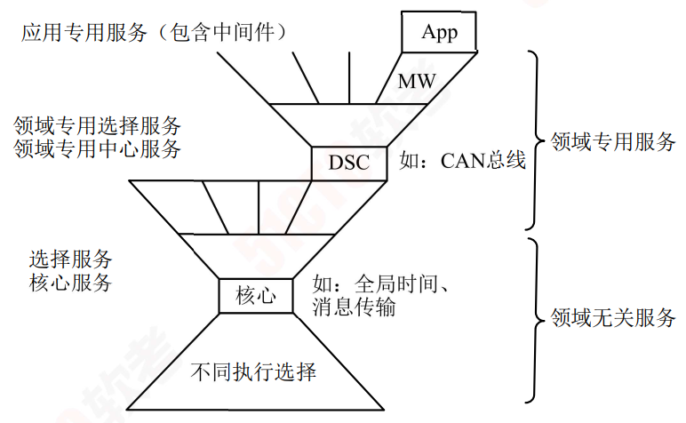

##### 领域无关服务

1. 核心服务

   - 全局时间
   - 消息传输等服务

2. 选择服务

   信息安全服务

   外部存储器管理器

    Internet网关服务

##### 领域专用服务

由领域特有的服务子集加上待开发领域特征的特定服务组合。

GENESYS架构从硬件、软件的观点遵循了**面向构件的风格**，分离了计算与通信，将计算构件和通信设施作为独立构件进行设计。

GENESYS架构的主要特征及优势包括：

1. 精确的构件定位。

   具体体现为**简单化**、**跨领域重用**、**规模的经济型**、**健壮性**、**可降低系统集成工作量**这 5个特征。

2. 开放性

   体现为具有**可集成性**、**可升级性**、**可扩展性**、**遗产系统集成**、**降低成本**这 5个特征。

3. 三级集成

   具有芯片级集成、设备级集成、系统级集成的集成。

4. 分层的服务

   体现具有可重用性、领域定位、工效经济型的特性。

5. 确定的核心

   体现在具有及时性、降低复杂性、可测试性、认证、故障掩蔽的特征。

6. 标准的互联集成

   体现在对远程访问的保护、降低集成工作难度、常规人机交互、具有安全性 4个方面。

#### 物联网操作系统软件架构

物联网操作系统至今没有一个明确的定义。

物联网操作系统通常包括：

- 芯片层
- 终端层
- 边缘层
- 云端层

物联网操作系统使用的软件以及技术主要有：

1. 开源物联网操作系统（FreeRTOS）
2. 公共服务组件（网络协议、外设支持、可移植操作系统接口 POSIX等）
3. 定制性服务组件有：
   - 消息队列遥测传输协议（MQTT）
   - 安全超文本传输协议（HTTPS）
   - 加密消息标准 PKCS #11支持，安全套件等。

物联网操作系统主要特征有：

1. 内核实时性
2. 内核尺寸伸缩性
3. 架构可扩展性
4. 高可靠性
5. 低功耗

## 通信系统架构设计理论与实践  

### 通信系统网络架构

通信网络主要形式：

1. 局域网
2. 广域网
3. 移动通信网

#### 局域网网络架构

局域网是单一机构专用计算机的网络。

设备组成：

1. 计算机
2. 交换机
3. 路由器

特点：

1. 覆盖地理范围小
2. 数据传输速率高
3. 低误码率
4. 可靠性高
5. 支持多种传输介质
6. 支持实时应用

局域网按网络拓扑分类有：

1. 总线型
2. 环型
3. 星型
4. 树型
5. 层次型等类型

按传输介质分类：

1. 有线局域网
2. 无线局域网

局域网网络架构有 4种类型：

1. ###### 单核心架构

   使用单台核心二层或三层交换设备作为网络核心。

   优点：结构简单，设备投资节约，接入方便。

   缺点：地理范围受限，核心单点故障，扩展能力有限，接入设备较多时核心端口密度要求高。

2. ###### 双核心架构

   采用两台核心三层及以上交换机作为网络核心。

   优点：网络拓扑结构可靠性高，接入较为方便。

   缺点：投资较单核心高，核心端口密度要求较高。

3. ###### 环型架构

   采用多台核心三层及以上交换机组成双动态弹性分组环（Resilient Packet Ring，RPR），作为网络核心。

   优点：RPR具备自愈保护，节省光纤资源，提供多等级、可靠的 QoS服务，有效利用带宽资源。

   缺点：投资较高，路由冗余设计实施难度较高且易形成环路，多环智能通过业务接口互通无法直通。

4. ##### 层次型架构

   由**核心层、汇聚层、接入层三层**交换设备和用户设备组成层次模型。

   - 核心层：负责高速数据转发。
   - 汇聚层：提供充足接口，与接入层间实现互访控制。
   - 接入层：用户设备接入。层次型架构的优点：易扩展，分级排查网络故障便于维护。

#### 广域网网络架构

广域网利用公用**分组交换网、无线分组交换网、卫星通信网**构建通信子网连接分布的局域网以实现资源子网的共享。

广域网组成：

1. 骨干网
2. 分布网
3. 接入网

广域网网络架构可以分为：

1. 单核心架构

   以单台核心三层交换设备作为网络核心。

   优点：结构简单，设备投资节约，局域网互访效率高，新局域网接入方便。

   缺点：核心单点故障，扩展能力欠佳，核心设备端口密度要求较高。

2. 双核心架构

   以两台核心三层及以上交换机作为网络核心。

   优点：网络拓扑结构可靠，路由可热切换，可靠性高，局域网接入较为方便。

   缺点：投资较单核心高，路由冗余设计实施难度较高，核心端口密度要求较高。

3. 环型架构

   以多台核心三层及以上交换机组成路由环路作为网络核心。

   优点：接入方便。

   缺点：投资较高，路由冗余设计实施难度较高且易形成环路，核心端口密度要求较高。

4. 半/全冗余架构

   以多台核心路由设备间互连组成网络核心，如任意核心存在两条以上到其他核心的链路为半冗余架构，如任何两个核心间均存在链路为全冗余架构。

   优点：结构灵活，路由灵活，方便扩展，可靠性高。

   缺点：结构零散，不便管理，不便排障。

5. 对等子域架构

   将半冗余核心划为两个独立子域，子域间通过一条或多条链路互连。

   优点：路由控制灵活。

   缺点：子域间冗余设计实施难度较高，易形成环路或存在非法路由风险，子域互连设备性能要求高。

6. 层次子域架构

   半冗余核心划为多个独立子域，子域间存在层次关系，高层次子域连接多个低层次子域。

   优点：扩展性较好，路由控制灵活。

   缺点：子域路由冗余设计实施难度较高，易形成环路或存在非法路由风险，子域互连设备性能要求高。

#### 移动通信网网络架构

5G系统为移动终端用户提供数据网络互连，数据网络可以是互联网、IP媒体子系统、专用网络。

用户设备通过 5G系统接入数据网络的方式有**透明模式**和**非透明模式**。

在透明模式下 ，5G系统通过用户面功能接口接入运营商网络，然后通过防火墙或者代理连至 Internet。

非透明模式下，5G系统可以直接或通过其他网络连接至运营商网络或 Internet。

#### 5G网络边缘计算

5G网络边缘计算能为垂直行业提供诸如以时间敏感、高带宽为特征的业务就近分流服务。

一来为用户提供极佳的服务体验，二来降低了移动网络后端处理的压力。

#### 软件定义网络（Software Defined Network，SDN）

SDN是一种新型网络创新架构

核心思想是通过控制与转发分离，将网络中交换设备的控制逻辑集中到一个计算设备上，控制面集中管控，提升网络管理配置能力。

#### 存储网络架构

存储网络设计磁盘存储访问方式：

1. ##### 直连式存储（Direct Attached Storage，DAS）

   存储设备通过 IDE/ATA/SCSI接口或光纤通道直接连接到单台计算机，计算机通过 I/O访问存储设备，存储设备可以是硬盘驱动器、RAID阵列、CD、DVD、磁带驱动器。

2. ##### 网络附加存储（Network Attached Storage，NAS）

   存储设备通过标准的网络拓扑结构连接到计算机群组，计算机通过 IP局域网或广域网 TPC或 UDP协议，通过 RPC接口访问 NAS存储设备。

3. ##### 存储区域网络（Storage Area Network，SAN）

   一种采用网状通道技术专门为存储建立的独立于 TCP/IP网络之外的专用网络，通过网状通道交换机连接存储阵列和服务器。3种存储网络架构的对比见表

| 对比项   | DAS                  | NAS                              | SAN                  |
| -------- | -------------------- | -------------------------------- | -------------------- |
| 架构类别 | 单机存储架构         | 网络存储架构                     | 网络存储架构         |
| 访问方式 | I/O总线              | 网络                             | 网络                 |
| 资源利用 | 单机存储             | 共享存储                         | 共享存储             |
| 访问媒介 | 总线                 | 以太网                           | 以太网/光纤通道      |
| 优势特点 | 易用易管理设备成本低 | 易用易管理可扩展性高设备成本较低 | 高性能低延迟灵活性高 |

### 网络构建关键技术

IPv4与 IPv6融合组网技术。目前网络演进还存在较长时间 IPv4到 IPv6过渡期或 IPv4和 IPv6网络共存期。

现阶段主要存在 3种过渡技术：

1. 双协议栈：两种协议在同一平台上双栈共存，同时运行。
2. 隧道技术：包括 ISATAP隧道、6to4隧道、over6隧道、6over4隧道。
3. 网络地址翻译（Network Address Translator，NAT）技术：将 IPv4地址和 IPv6地址分别看作内部地址和外部地址，或者相反，以实现地址转换。

### 网络构建

#### 网络需求分析

网络需求分析主要**从业务需求、用户需求、应用需求、计算机平台需求和网络需求**来进行分析。

#### 网络技术遴选及设计

网络技术遴选及设计可以使用**生成树协议、虚拟局域网（VLAN）、无线局域网（WLAN）、线路冗余设计、服务器冗余设计**等方式。

#### 广域网技术遴选

广域网技术遴选可以采用远程接入技术、广域网互连技术，如数字数据网络（DDN）、同步数字体系（SDH）、多业务传送平台（MSTP）、虚拟专用网络（VPN）等。

广域网性能优化策略有：

1. 预留带宽
2. 利用拨号线路
3. 传输数据压缩
4. 链路聚合
5. 数据基于优先级排序
6. 基于协议预留带宽

#### 层次化网络模型设计

层次化设计的优点是能降低成本，充分利用模块化设备/部件，网络变化或演化容易。

层次化网络设计一般采用三层模型设计思路：接入层、汇聚层、核心层。

层次化设计的原则：

1. 控制网络层次。
2. 从接入层开始，向上分析规划。
3. 尽量采用模块化设计。
4. 严格控制网络结构。
5. 严格控制层次化结构。

#### 网络安全控制技术

实施网络安全控制的相关技术主要有：

1. 防火墙

   防护墙是网络间的安全屏障，可以保护本地网络资源。

   防火墙可以**允许/拒绝/重定向数据流以及审计进出网络**的访问或服务。

   防火墙的体系：

   1. 硬件防火墙
   2. 软件防火墙
   3. 嵌入式防火墙。

   防火墙的种类：

   1. 包过滤
   2. 应用层网关
   3. 代理服务等。

2. 虚拟专用网络技术

   该技术利用公共网络建立私有专用网络。

   优点：

   1. 成本低
   2. 接入方便
   3. 可扩展性强
   4. 管理和控制方便。

3. 访问控制技术

   1. 自主访问控制（DAC）
   2. 强制访问控制（MAC）
   3. 基于角色的访问控制（RBAC）
   4. 基于任务的访问控制（TBAC）
   5. 基于对象的访问控制（OBAC）

4. 网络安全隔离

   将攻击隔离在网络外，保证网络内信息不外泄。

   形式：

   1. 子网隔离
   2. 物理隔离
   3. VLAN隔离
   4. 逻辑隔离

5. 网络安全协议

#### 网络安全审计

网络安全审计用来测试，评估和分析网络脆弱性，能够实现**自动响应、数据生成、分析、浏览、事件存储、事件选择**等功能。

#### 绿色网络设计方法

绿色网络设计采用**精简设计、重用设计、回收设计**的思路。

设计原则：

1. 标准化：减少转换设备，兼容异构方案。
2. 集成化：减少设备总量，降低资源需求。
3. 虚拟化：灵活调配，按需使用。
4. 智能化：降低人力成本，降低资源占用。  

## 安全架构设计理论与实践  

### 信息安全面临的威胁

#### 信息系统安全威胁的来源

威胁可以来源于物理环境、通信链路、网络系统、操作系统、应用系统、管理系统。

网络与信息安全风险类别

网络与信息安全风险类别可以分为：

1. 人为蓄意破坏（被动型攻击，主动型攻击）
2. 灾害性攻击
3. 系统故障
4. 人员无意识行为

网络与信息安全风险  

1. 人为蓄意破坏 
   1. 被动型攻击 
      1. 网络监听
      2. 非法登录
      3. 信息截取  
   2. 主动型攻击 
      1. 数据篡改
      2. 假冒身份
      3. 拒绝服务
      4. 重放攻击
      5. 散播病毒
      6. 主观抵赖  
2. 灾害性攻击
   1. 水灾
   2. 火灾
   3. 地震
   4. 雷击
   5. 战争  
3. 系统故障  
   1. 硬件故障
   2. 软件故障
   3. 链路故障
   4. 供电故障  
4.  人员无意识行为
   1. 编程错误
   2. 操作错误
   3. 无意泄密  

#### 常见的安全威胁

1. 信息泄露。信息被泄露或透露给某个非授权的实体。
2. 破坏信息的完整性。数据被非授权地进行增删、修改或破坏而受到损失
3. 拒绝服务。对信息或其他资源的合法访问被无条件地阻止。
4. 非法使用（非授权访问）。某一资源被某个非授权的人或以非授权的方式使用。
5. 窃听。用各种可能的合法或非法的手段窃取系统中的信息资源和敏感信息。如对通信线路中传输的信号进行搭线监听，或利用通信设备在工作过程中产生的电磁泄漏截取有用信息等。
6. 业务流分析。通过对系统进行长期监听，利用统计分析方法对诸如通信频度、通信的信息流向、通信总量的变化等态势进行研究，从而发现有价值的信息和规律。
7. 假冒。通过欺骗通信系统（或用户）达到非法用户冒充成为合法用户，或者特权小的用户冒充成为特权大的用户的目的。黑客大多是采用假冒的方式进行攻击。
8. 旁路控制。攻击者利用系统的安全缺陷或安全性上的脆弱之处获得非授权的权利或特权。如，攻击者通过各种攻击手段发现原本应保密，但是却又暴露出来的一些系统“特性”。利用这些“特性”，攻击者就可以绕过防线守卫者侵入系统的内部。
9. 授权侵犯。被授权以某一目的使用某一系统或资源的某个人，却将此权限用于其他非授权的目的，也称作“内部攻击”。
10. 特洛伊木马。软件中含有一个察觉不出的或者无害的程序段，当它被执行时，会破坏用户的安全。这种应用程序称为特洛伊木马。
11. 陷阱门。在某个系统或某个部件中设置了“机关”，使得当提供特定的输入数据时，允许违反安全策略。
12. 抵赖。这是一种来自用户的攻击，例如，否认自己曾经发布过的某条消息、伪造一份对方来信等。
13. 重放。所截获的某次合法的通信数据备份，出于非法的目的而被重新发送。
14. 计算机病毒。所谓计算机病毒，是一种在计算机系统运行过程中能够实现传染和侵害的功能程序。
15. 人员渎职。一个授权的人为了钱或利益，或由于粗心，将信息泄露给一个非授权的人。
16. 媒体废弃。信息被从废弃的磁盘或打印过的存储介质中获得。
17. 物理侵入。侵入者通过绕过物理控制而获得对系统的访问。
18. 窃取。重要的安全物品遭到窃取，如令牌或身份卡被盗。
19. 业务欺骗。某一伪系统或系统部件欺骗合法的用户，或使系统自愿地放弃敏感信息。

#### 安全体系架构的范围

安全体系架构的范围包括：

1. 安全防线。分别是产品安全架构、安全技术架构、审计架构。
2. 安全架构特性。安全架构应具有：可用性、完整性、机密性的特性。
3. 安全技术架构。安全技术架构主要包括身份鉴别、访问控制、内容安全、冗余恢复、审计响应、恶意代码防范、密码技术。

### 安全模型

#### 信息系统安全目标

信息系统安全目标是**控制和管理主体对客体的访问**，从而实现：

1. 保护系统可用性。
2. 保护网络服务连续性。
3. 防范非法非授权访问。
4. 防范恶意攻击和破坏。
5. 保护信息传输机密性和完整性。
6. 防范病毒侵害。
7. 实现安全管理。

#### 典型安全模型

1. 状态机模型

   一个安全状态模型系统，总是从一个安全状态启动，并且在所有迁移中保持安全状态，只允许主体以和安全策略相一致的安全方式访问资源。

2. BLP模型（Bell-LaPadula Model）

   该模型为数据规划机密性，依据机密性划分安全级别，按安全级别强制访问控制。

BLP模型的基本原理是：

1.  安全级别是“机密”的主体访问安全级别为“**绝密**”的客体时，**主体对客体可写不可读****。
2. 安全级别是“机密”的主体访问安全级别为“**机密**”的客体时，主体对客体**可写可读。**
3. 安全级别是“机密”的主体访问安全级别为“**秘密**”的客体时，主体对客体**可读不可写**。

BLP模型安全规则：

1. 简单规则：低级别主体读取高级别客体受限。
2. 星型规则：高级别主体写入低级别客体受限。
3. 强星型规则：对不同级别读写受限。
4. 自主规则：自定义访问控制矩阵。

##### Biba模型

该模型建立在完整性级别上。

模型具有完整性的三个目标：

1. 保护数据不被未授权用户更改
2. 保护数据不被授权用户**越权修改**（未授权更改）
3. 维持数据内部和外部的**一致性**。

Biba模型基本原理：

1.  完整性级别为“中完整性”的主体访问完整性为“高完整性”的客体时，主体对客体**可读不可写**，也**不能调用主体的任何程序和服务**。
2. 完整性级别为“中完整性”的主体访问完整性为“中完整性”的客体时，主体对客体**可读可写**。
3. 当完整性级别为“中完整性”的主体访问完整性为“低完整性”的客体时，主体对客体**可写不可读**。

Biba模型可以**防止数据从低完整性级别流向高完整性级别**，其安全规则如下：

1.  星完整性规则。表示完整性级别低的主体不能对完整性级别高的客体写数据。
2. 简单完整性规则。表示完整性级别高的主体不能从完整性级别低的客体读取数据。
3. 调用属性规则。表示一个完整性级别低的主体不能从级别高的客体调用程序或服务。

##### CWM模型（Clark-Wilson Model）

将完整性目标、策略和机制融为一体，提出职责分离目标，应用完整性验证过程，**实现了成型的事务处理机制**，常用于银行系统。

CWM模型具有以下特征：

1. 包含主体、程序、客体三元素，主体只能通过程序访问客体。
2. 权限分离原则，功能可分为多主体，防止授权用户进行未授权修改。
3. 具有审计能力。

##### Chinese Wall模型

是一种混合策略模型，应用于多边安全系统，防止多安全域存在潜在的冲突。该模型为投资银行设计，常见于金融领域。

工作原理是通过自主访问控制（DAC）选择安全域，通过强制访问控制（MAC）完成特定安全域内的访问控制。

Chinese Wall模型的安全规则： 

1. 墙内客体可读取。
2. 不同利益冲突组客体可读取。
3. 访问其他公司客体和其他利益冲突组客体后，主体对客体写入受限。

### 信息安全整体架构设计

##### WPDRRC信息安全模型

WPDRRC模型包括 6个环节：

1. 预警（Warning）
2. 保护（Protect）
3. 检测（Detect）
4. 响应（React）
5. 恢复（Restore）
6. 反击（Counterattack）

个要素：

1. 人员
2. 策略
3. 技术

##### 信息安全体系架构

具体可以从以下 5个方面开展安全体系的架构设计工作：

1.  物理安全（前提）：包括环境安全、设备安全、媒体安全。
2. 系统安全（基础）：包括网络结构安全、操作系统安全、应用系统安全。
3. 网络安全（关键）：包括访问控制、通信保密、入侵检测、网络安全扫描、防病毒。
4. 应用安全：包括资源共享、信息存储。
5. 安全管理：包括健全的体制、管理平台、人员安全防范意识。

### 网络安全架构设计

（1）OSI/RM信息安全架构

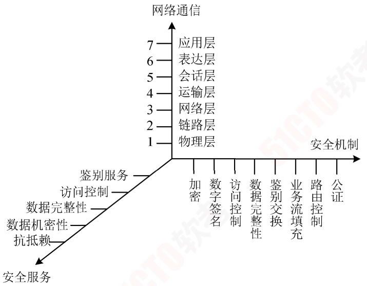

安全服务和安全机制的对应关系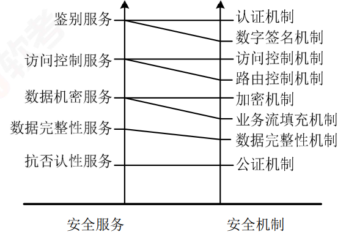

OSI定义了分层多点的安全技术体系架构，又叫深度防御安全架构，它通过以下 3种方式将防御能力分布至整个信息系统中。

1. 多点技术防御：通过网络和基础设施，边界防御（流量过滤、控制、如前检测），计算环境等方式进行防御。
2. 分层技术防御：外部和内部边界使用嵌套防火墙，配合入侵检测进行防御。
3. 支撑性基础设施：使用公钥基础设施以及检测和响应基础设施进行防御。

##### 认证框架

认证又叫鉴权，其目的是**防止其他实体占用和独立操作被鉴别实体的身份**。

鉴别的方式有：

1. 已知的（口令）
2. 拥有的（IC卡，令牌等）
3. 不可变特征（生物特征）
4. 受信第三方鉴别
5. 环境（主机地址）

鉴别服务**阶段**分为：

1. 安装
2. 修改鉴权信息
3. 分发
4. 获取
5. 传送
6. 验证
7. 停活
8. 重新激活
9. 取消安装

#### 访问控制框架

当发起者请求对目标进行特殊访问时，访问控制管制设备（Access Control Enforcement Facilities，AEF）就通知访问控制决策设备（Access Control Decision Facilities，ADF）， ADF可以根据上下文信息（包括发起者的位置、访问时间或使用中的特殊通信路径）以及可能还有以前判决中保留下来的访问控制决策信息（Access Control Decision Information，ADI）做出允许或禁止发起者试图对目标进行访问的判决。

##### 机密性框架

机密性服务目的是确保信息仅仅是对被授权者可用。

机密性机制包括：

1. 通过禁止访问提供机密性
2. 通过加密提供机密性

##### 完整性框架

完整性服务目的是**组织威胁或探测威胁，保护数据及其相关属性的完整性**。

完整性服务分类有：

1. 未授权的数据创建
2. 数据创建
3. 数据删除
4. 数据重放

完整性机制类型分为两种：

1. 阻止媒体访问
2. 探测非授权修改

##### 抗抵赖框架

抗抵赖服务的目的是提供特定事件或行为的证据。

抗抵赖服务阶段分为 5个阶段：

1. 证据生成
2. 证据传输
3. 存储及回复
4. 证据验证
5. 解决纠纷

### 数据库系统安全设计

#### 数据库完整性设计原则

完整性设计原则具体包括：

1. 依据完整性约束类型设计其实现的系统层次和方式，并考虑性能。
2. 在保障性能的前提下，尽可能**应用实体完整性约束**和**引用完整性约束**。
3. 慎用触发器。
4. 制订并使用完整性约束命名规范。
5. **测试数据库完整性**，尽早排除冲突和性能隐患。
6. 设有数据库设计团队，参与数据库工程全过程。
7. 使用 CASE工具，降低工作量，提高工作效率。

#### 数据库完整性的作用

数据库完整性的作用体现在以下几个方面：

1. 防止不合语义的数据入库。
2. 降低开发复杂性，提高运行效率
3. 通过测试尽早发现缺陷。

###  系统架构脆弱性分析

#### 系统架构脆弱性组成

系统架构脆弱性包括：

1. 物理装备脆弱性
2. 软件脆弱性
3. 人员管理脆弱性
4. 规章制度脆弱性
5. 安全策略脆弱性

#### 典型架构的脆弱性表现

##### 分层架构

分层脆弱性体现在：

1. 层间脆弱性：一旦某个**底层发生错误**，那么整个程序将会无法正常运行。
2. 层间通信脆弱性：如在面向对象方法中，将会存在大量对象成员方法的调用（消息交互），这种**层层传递，势必造成性能的下降**。

##### C/S架构

这种架构的脆弱性有：

1. 客户端脆弱性
2. 网络开放性脆弱性
3. 网络协议脆弱性

##### B/S架构。

如果 B/S架构使用的是 HTTP协议，会更容易被病毒入侵。

#### 事件驱动架构

事件驱动架构的脆弱性体现在：

1. 组件脆弱性
2. 组件间交换数据的脆弱性
3. 组件间逻辑关系的脆弱性
4. 事件驱动容易死循环
5. 高并发脆弱性
6. 固定流程脆弱性

##### MVC架构

MVC架构的脆弱性体现在以下 3方面：

1. 复杂性脆弱性。如一个简单的界面，如果严格遵循 MVC方式，使得模型、视图与控制器分离，会增加结构的复杂性，并可能产生过多的更新操作，降低运行效率。
2. 视图与控制器连接紧密脆弱性。视图与控制器是相互分离但却是联系紧密的部件，如果没有控制器的存在，视图应用是有限的。反之亦然，这就妨碍了它们的独立重用。
3. 视图对模型低效率访问脆弱性。依据模型操作接口的不同，视图可能需要多次调用才能获得足够的显示数据。对未变化数据的不必要的频繁访问也将损害操作性能。

##### 微内核架构

微内核架构的脆弱性体现在： 

1. 整体优化脆弱性。微内核系统的核心态只实现了最基本的系统操作，因此内核以外的外部程序之间的独立运行使得系统**难以进行良好的整体优化**
2. 进程通信开销脆弱性。微内核系统的**进程间通信开销也较单一内核系统要大得多**。
3. 通信损失脆弱性。微内核把系统分为各个小的功能块，从而降低了设计难度，系统的维护与修改也容易，但带来的问题是通信效率的损失。

##### 微服务架构

微服务架构的脆弱性体现在：

1. 分布式结构复杂带来的脆弱性。开发人员需要处理分布式系统的复杂结构。
2. 服务间通信带来的脆弱性。开发人员要设计服务之间的通信机制，通过写代码来处理消息传递中速度过慢或者不可用等局部实效问题。
3. 服务管理复杂性带来的脆弱性。在生产环境中要管理多个不同的服务实例，这意味着开发团队需要全局统筹。

### 安全架构设计实践

#### 远程认证拨号用户服务（Remote Authentication Dial-In User Service，RADIUS）

RADIUS是应用最广泛的高安全级别认证、授权、审计协议（Authentication，Authorization， Accounting，AAA），具有高性能和高可扩展性，且可用多种协议实现。

RADIUS通常由 3层组成层次式架构：

1. 协议逻辑层

   起到分发处理功能，相当于转发引擎。

2. 业务逻辑层

   实现认证、授权、审计三种类型业务及其服务进程间的通信。

3. 数据逻辑层

   实现统一的数据访问代理池，降低数据库依赖，减少数据库压力，增强系统的数据库适应能力。

基于混合云的工业安全生产管理系统

混合云融合了公有云和私有云。

在基于混合云的工业安全生产管理系统中，工厂内部的**产品设计、数据共享、生产集成**使用私有云实现。

公有云则用于**公司总部与智能工厂间的业务管理**、**协调和统计分析**等。

整个生产管理系统架构采用层次式架构，分为：

1. ##### 设备层

   包括智能工厂生产用设备，包括智能传感器、智能仪器仪表、工业机器人、其他生产设备。

2. ##### 控制层

   1. 包括智能设备控制用自动控制系统，包括：
   2. 采集与监视控制系统（Supervisory Control and Data Acquisition，SCADA）
   3. 分布式控制系统（Distributed Control System，DCS）
   4. 现场总线控制系统（Fieldbus Control System，FCS）
   5. 可编程控制器（Programmable Logic Controller， PLC）（内置编程程序）
   6. 人机接口（Human Machine Interface，HMI）
   7. 其他现场控制程序

3. ##### 设计/管理层

   包括智能工厂所有控制开发，业务控制和数据管理相关系统及其功能的集合，实现了数据集成和应用，包括：

   1. 制造执行系统（Manufacturing Execution System，MES）（很多企业称之为生产信息管理系统）、
   2. 计算机辅助设计/工程/制造 CAD/CAE/CAM、供应链管理（Supply Chain Management，SCM）
   3. 企业资源规划（ERP）
   4. 客户关系管理（Customer Relationship Management， CRM）
   5. 供应商关系管理（Supplier Relationship Management，SRM）
   6. 商业智能分析（Business Intelligence，BI）
   7. 产品生命周期管理（Product Life-Cycle Management，PLM）。

4. ##### 应用层

   云平台上的信息处理，包括数据处理与管理、数据与行业应用相结合，如定制业务、协同业务、产品服务。

   在设计基于混合云的工业安全生产管理系统时，需要考虑的安全问题有：

   1. 设备安全
   2. 网络安全
   3. 控制安全
   4. 应用安全
   5. 数据安全

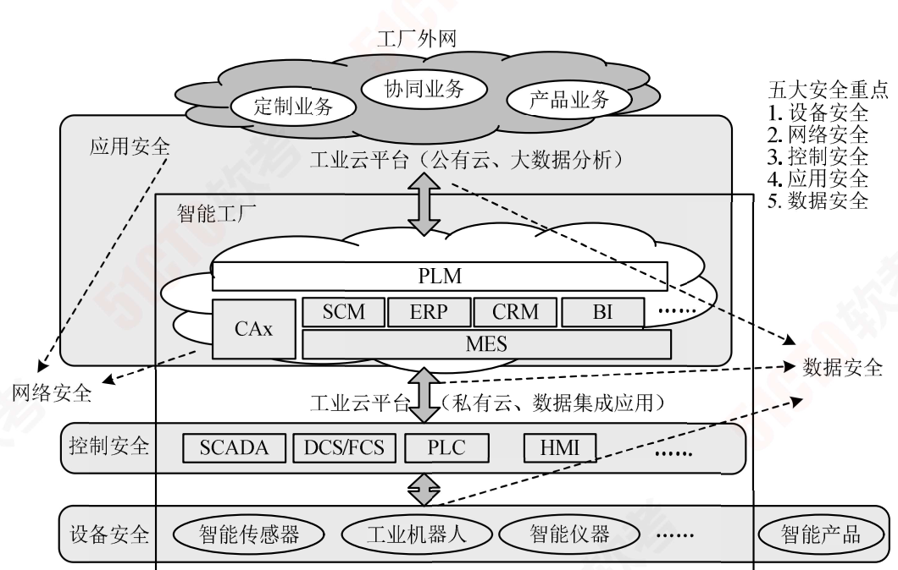

## 大数据架构设计理论与实践  

### 传统数据处理系统的问题

#### 传统数据库的数据过载问题

传统应用的数据系统架构设计时，应用直接访问数据库系统。当用户访问量增加时，数据库**无法支撑日益增长的用户请求的负载**，从而**导致数据库服务器无法及时响应用户请求，出现超时的错误**。

关于这个问题的常用解决方法如下：

1. 增加异步处理队列，通过工作处理层批量处理异步处理队列中的数据修改请求。
2. 建立数据库水平分区，通常建立 Key分区，以主键/唯一键 Hash值作为 Key。
3. 建立数据库分片或重新分片，通常专门编写脚本来自动完成，且要进行充分测试。
4. 引入读写分离技术，主数据库处理写请求，通过复制机制分发至从数据库。
5. 引入分库分表技术，按照业务上下文边界拆分数据组织结构，拆分单数据库压力。

#### 大数据的特点

大数据具有**体量大**、**时效性强**的特点，并非构造单调，而是**类型多样**；

处理大数据时，传统数据处理系统因数据过载，来源复杂，类型多样等诸多原因性能低下，**需要采用以新式计算架构和智能算法为代表的新技术**；

大数据的应用重在发掘数据间的**相关性**，而非传统逻辑上的因果关系；

大数据的目的和价值就在于**发现新的知识，洞悉并进行科学决策**。

现代大数据处理技术，主要分为以下几种：

1. 基于分布式文件系统 Hadoop。
2. 使用 Map/Reduce或 Spark数据处理技术。
3. 使用 Kafka数据传输消息队列及 Avro二进制格式。

#### 大数据利用过程

大数据的利用过程分为 4个过程：

1. 采集
2. 清洗
3. 统计
4. 挖掘

### 大数据处理系统架构分析

#### 大数据处理系统面临的挑战

1. 如何利用信息技术等手段**处理非结构化和半结构化数据**。
2. 如何**探索大数据复杂性、不确定性特征描述的刻画方法**及大数据的**系统建模**。
3. 数据异构性与决策异构性的关系对**大数据知识发现与管理决策的影响**。

#### 大数据处理系统的属性和特征

1. 鲁棒性和容错性
2. 低延迟
3. 横向扩展（通过增强机器性能扩展）
4. 通用
5. 可扩展
6. 即席查询（用户按照自己的要求进行查询）
7. 最少维护
8. 可调试

### 典型的大数据架构

#### Lambda架构

Lambda架构是一种用于同时处理**离线**和**实时**数据的、可容错的、可扩展的分布式系统。

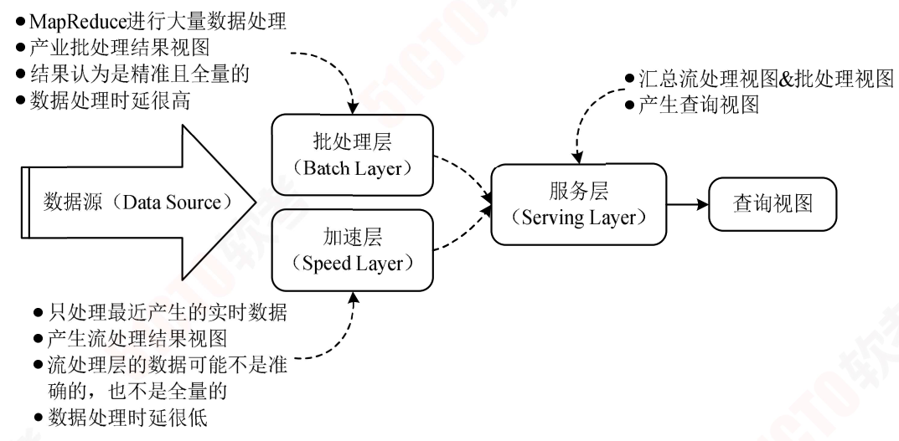

Lambda架构分为以下 3层：

1. ##### 批处理层

   该层核心功能是存储主数据集。

   主数据集数据特征：

   1. 原始
   2. 不可变
   3. 真实的

   批处理层**周期性**地将**增量数据转储至主数据集**，并在主数据集上执行批处理，**生成批视图**。

   架构实现方面可以使用 Hadoop HDFS或 HBase存储主数据集，再利用 Spark或 MapReduce执行周期批处理，之后**使用 MapReduce创建批视图**。

2. ##### 加速层

   核心功能：处理增量**实时数据**，生成实时视图，快速执行即席查询。

   架构实现方面可以使用 Hadoop HDFS或 HBase存储实时数据，**利用 Spark或 Storm实现实时数据处理和实时视图**。

3. ##### 服务层

   核心功能：**响应用户请求，合并批视图和实时视图中的结果数据集得到最终数据集。**

   具体来说就是接收用户请求，通过索引加速访问批视图，直接访问实时视图，然后合并两个视图的结果数据集生成最终数据集，响应用户请求。

   架构实现方面可以使用 HBase或Cassandra作为服务层，通过 **Hive创建可查询的视图**。

Lambda架构的优点：

1. 容错性好
2. 查询灵活度高
3. 弹性伸缩
4. 易于扩展。

Lambda架构的缺点：

1. 编码量大
2. 持续处理成本高
3. 重新部署和迁移成本高。

与 Lambda架构相似的模式有事件溯源模式、命令查询职责分离模式。

#### Kappa架构

Kappa架构是在 Lambda架构的基础上进行了优化，**删除了 Batch Layer的架构，将数据通道以消息队列进行替代**。

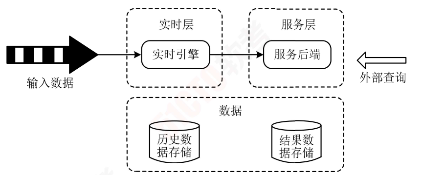

Kappa架构分为如下 2层：

1. ##### 实时层

   核心功能：处理输入数据，生成实时视图。具体来说是采用流式处理引擎逐条处理输入数据，生成实时视图。

   架构实现方式是**采用 Apache Kafka回访数据**，然后**采用 Flink或 Spark Streaming进行处理**。

2. ##### 服务层

   核心功能：使用实时视图中的结果数据集响应用户请求。

   实践中使用数据湖中的存储作为服务层。

    Kappa架构本质上是通过改进 Lambda架构中的加速层，使它既能够进行实时数据处理，同时也有能力在业务逻辑更新的情况下重新处理以前处理过的历史数据。

Kappa架构的优点：

- 将离线和实时处理代码进行了统一，方便维护。

Kappa架构的缺点：

- 消息中间件有性能瓶颈
- 数据关联时处理开销大
- 抛弃了离线计算的可靠性

Kappa架构常见变形是 Kappa+架构

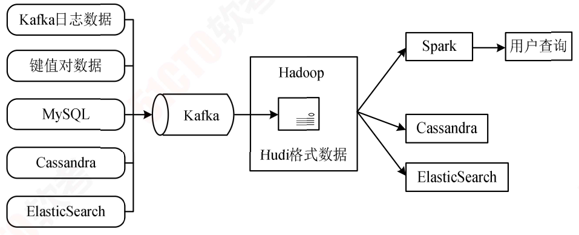

混合分析系统 Kappa架构

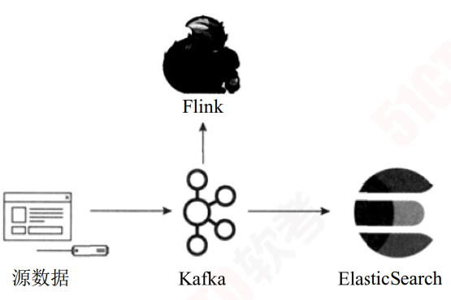

Lambda架构与 Kappa架构的对比两种架构特性对比 

| 对比内容             | Lambda架构                                                   | Kappa架构                                            |
| -------------------- | ------------------------------------------------------------ | ---------------------------------------------------- |
| 复杂度与开发维护成本 | 维护两套系统（引擎），**复杂度高，成本高**                   | 维护一套系统（引擎）复杂度低，成本低                 |
| 计算开销             | 周期性批处理计算，持续实时计算计算开销大                     | 必要时进行全量计算计算开销相对较小                   |
| 实时性               | 满足实时性                                                   | 满足实时性                                           |
| 历史数据处理能力     | 批式全量处理，吞吐量大历史数据处理能力强**批视图与实时视图存在冲突可能** | 流式全量处理，吞吐量相对较低历史数据处理能力相对较弱 |

对于两种架构设计的选择可以从以下 4个方面考虑

| 设计考虑           | Lambda架构                       | Kappa架构                      |
| ------------------ | -------------------------------- | ------------------------------ |
| 业务需求与技术要求 | 依赖 Hadoop、Spark、Storm技术    | 依赖 Flink计算引擎，偏流式计算 |
| 复杂度             | 实时处理和离线处理结果可能不一致 | 频繁修改算法模型参数           |
| 开发维护成本       | 成本预算充足                     | 成本预算有限                   |
| 历史数据处理能力   | 频繁使用海量历史数据             | 仅使用小规模数据集             |

### 大数据架构的实践

#### 大规模视频网络

某网采用以 Lambda架构搭建的大数据平台处理里约奥运会大规模视频网络观看数据。

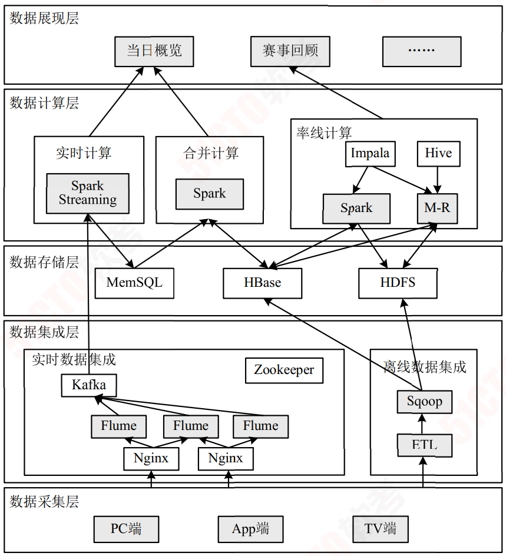

对于图中的数据计算层可以分为**离线计算、实时计算、合并计**算 3个部分。

离线计算部分：用于存储持续增长的批量离线数据，并且会周期性地使用 Spark和Map/Reduce进行批处理，将批处理结果更新到批视图之后使用 Impala或者 Hive建立数据仓库，将结果写入 HDFS中。

实时计算部分：采用 Spark Streaming，只处理实时增量数据，将处理后的结果更新到实时视图。

合并计算部分：合并批视图和实时视图中的结果，生成最终数据集，将最终数据集写入HBase数据库中用于响应用户的查询请求。

#### 广告平台

某网基于 Lambda架构的广告平台，分为批**处理层（Batch Layer）、加速层（Speed Layer）、服务层（Serving Layer）**。

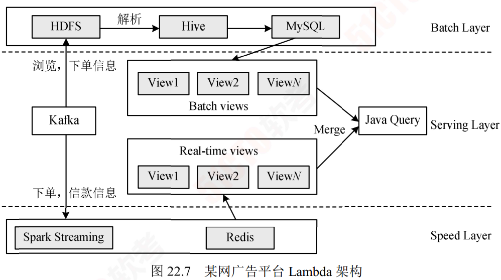

批处理层：每天凌晨将 Kafka中浏览、下单等消息同步到 HDFS中，将 HDFS中数据解析为 Hive表，然后使用 HQL或 Spark SQL计算分区统计结果 Hive表，将 Hive表转储到 MySQL中作为批视图。

加速层：使用 Spark Streaming实时监听 Kafka下单、付款等消息，计算每个追踪链接维度的实时数据，将实时计算结果存储在 Redis中作为实时视图。

服务层：采用 Java Web服务，对外提供 HTTP接口，Java Web服务读取 MySQL批视图表和 Redis实时视图表。

公司智能决策大数据系统

某证券公司智能决策大数据系统是一个基于 Kappa架构的实时日志分析平台，如图 所示。

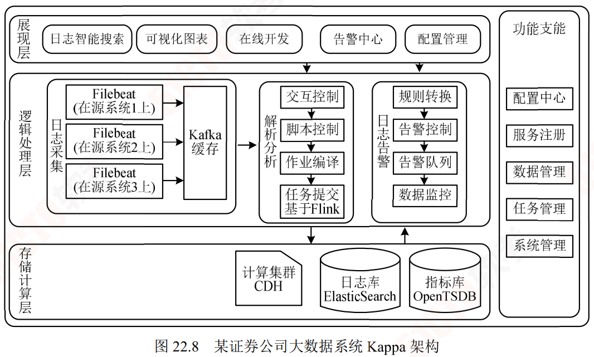

具体的实时处理过程如下：

日志采集：用统一的数据处理引擎 Filebeat实时采集日志并推送给 Kafka缓存。

清洗解析：利用基于大数据计算集群的 Flink计算框架实时读取 Kafka消息并进行清洗，解析日志文本转换成指标。

日志存储：日志转储到 ElasticSearch日志库，指标转储到 OpenTSDB指标库。

日志监控：单独设置告警消息队列，保持监控消息时序管理和实时推送。

#### 电商智能决策大数据系统

该智能决策大数据平台基于 Kappa架构，使用统一的数据处理引擎 Funk可实时处理流数据，并将其存储到数据仓库工具 Hive与分布式缓存 Tair中，以供后续决策服务的使用。如图 所示。

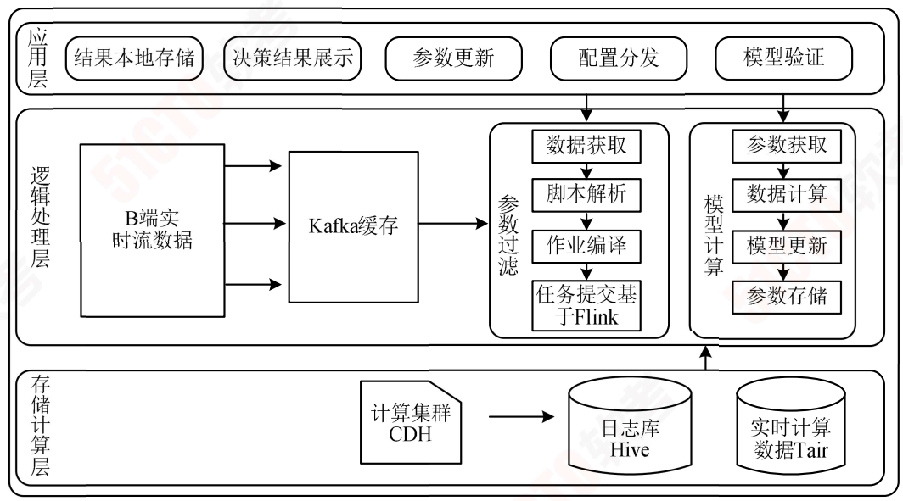

实时处理的过程如下：

数据采集：B端实时采集用户点击、下单、广告曝光、出价等数据然后推送给 Kafka缓存。

数据清洗聚合：由 Flink实时读取 Kafka消息，按需过滤参与业务需求的指标，将聚合时间段的数据转换成指标。

数据存储：Flink将计算结果转储至 Hive日志库，将模型需要的参数转储至实时计算数据库 Tair缓存，然后后续决策服务从 Tair中获取数据进行模型训练。
